# Ana

# WEEK 1

## 1/06/26

- Papers review
    - [MET](https://metr.org/time-horizons/)R
        - 50%-task-completion time horizon, the time humans typically take to complete tasks that AI models can complete with 50% success rate
        - We also measure the 80% time horizon
        - notably, performance is much lower on less structured, “messier” tasks
            
            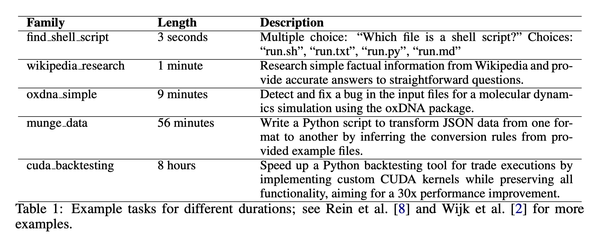
            
        - There is a strong upwards trend over
        time, with recent models completing approximately 50% of all tasks, while earlier models perform
        substantially worse. We find substantial correlation between the tasks that models can complete
        (Figure 22), with average correlation of approximately 0.73
            
            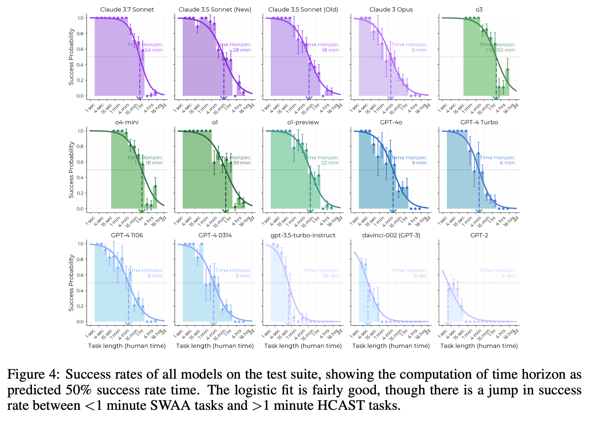
            
        - Therefore, we are more confident in the slope of the time horizon trend than
        in the time horizon of any particular model. The fit is not sensitive to various hyperparameters such
        as regularization, weighting of tasks, and WLS vs. OLS (see Figure 6).
            
            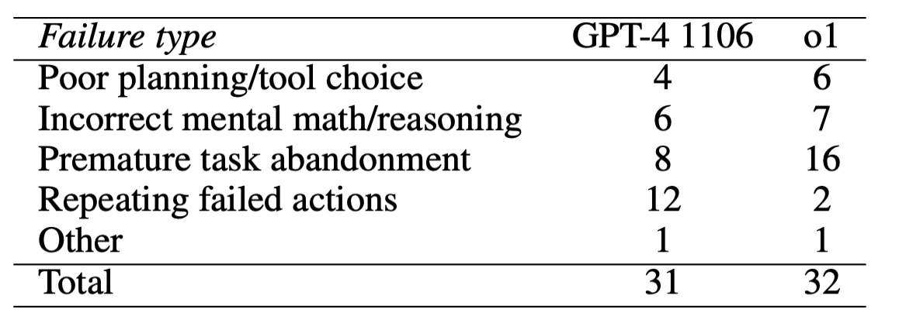
            
        - First, Ngo [21] writes that a 1-month AGI (defined as an AI that
        outperforms most knowledgeable humans who are given 1 month of work hours, i.e. 167 hours, to
        perform the task) would necessarily exceed human performance at economically valuable endeavors
        like writing large software applications, founding startups, and making novel scientific discoveries
        - Second, one month is around the period when new hires at a company begin to complete onboarding
        and generate economic value,9 and so an AI with a horizon of 1 month could be capable of ac-
        quiring context like a human employee, allowing it to complete high-context as well as low-context
        tasks.
        - Finally, we attempt to extrapolate the trend on these tasks to one-month (167 hours) AI (Section 5),
        finding that if the trend continues and observed performance trends generalize to real-world tasks,
        an 80% confidence interval for the release date of AI that can complete 1-month long software tasks
        spans from mid-2028 to mid-2030 (Section 5)– or even as soon as early 2027 if the 2024–2025 trend
        continues.
        - AI agent = **an AI model and a scaffold**
    - https://faculty.ai/a-bayesian-framework-for-forecasting-and-scenario-analysis-of-ai-task-automation
        - mapped the feasibility of AI task automation
        - One seminal framework for longitudinal forecasting was introduced by Kwa et al. (2025)
        from METR (Model Evaluation & Threat Research), which identified that the “50%-task-
        completion time horizon”—the maximum task duration a model can handle with 50% success—has been doubling approximately every seven months
        - Task Length, the time a human professional needs
        for completion; Task Messiness, which is a proxy for task complexity, based on real-world factors like resource constraints or dynamic environments; and Effective Compute, the effective training compute used to train the LLM performing the task.
        - A further limitation of current forecasting approaches—including our own—is the focus
        on fully autonomous AI performance.
        - in joint production, the contribution of any individual agent (human
        or AI) to total output cannot be straightforwardly isolated from the contributions of others.(Holmstrom, 1982).
            
            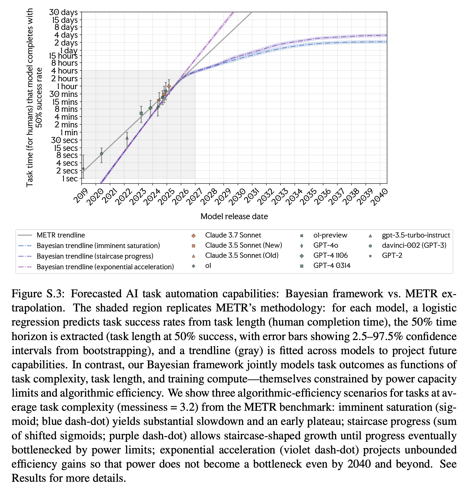
            
        - If AI capabilities depend on compute, and compute depends on physical infrastructure, how should we forecast automation once power, datacenters, and algorithmic progress are taken into account?
        - **Algorithmic progress matters more than power growth.** They test three scenarios:
            - **Sigmoid** (algorithmic progress saturates)
            - **Sum of sigmoids** (breakthroughs arrive in waves)
            - **Exponential** (no saturation). These produce dramatically different forecasts.
        - METR’s forecast is equivalent to assuming that capability growth can continue exponentially without major constraints.
        - 
    - [GDPval](https://arxiv.org/pdf/2510.04374)
        - EVALUATING AI MODEL PERFORMANCE ON REAL-WORLD ECONOMICALLY VALUABLE TASKS
        - 44 occupations across the top 9 sectors contributing to U.S. GDP
        - 30 tasks per occupation in the full set (and 5 tasks per occupation in the gold subset)
        - frontier model performance on GDPval is improving
        roughly linearly over time, and that the current best frontier models are approach-
        ing industry experts in deliverable quality
        - primary metric is win rate, which allows for continuous evaluation.
        - Tasks require an average of 7 hours of work for an expert professional to complete. On the high end, tasks span up to multiple weeks of work
        - To assess task quality, we asked occupational experts to rate each task on its difficulty, representativeness, time to complete, and overall quality against real-world standards for their occupation.
        - For the gold subset, we trained an experimental grading model to perform pairwise comparisons
        in the style of industry professional experts. Although limited, the automated grader is faster and
        cheaper than expert grading, and achieves 66% agreement with human expert graders, only 5%
        below human expert inter-rating agreement of 71%.
        - This distinction is also shown in section A.2.4, where GPT-5 performs better on pure text, while Claude performs better on file types like .pdf, .xslx, and .ppt, demonstrating better visual and aesthetic abilities
        - “try n times, and if still unsatisfactory, fix it yourself” approach as detailed in section A.2.1.
        - We also improved agent scaffolding by enabling GET requests in the container and performing best-of-N sampling with N=4 and a GPT-5 judge
        - Under-contextualized GDPval” section (section A.2.7) demonstrates how model performance degrades with less context
        - failures: catastrophic, bad, accetable but subpar, n/a (model better)
        - under-contextualised gdpval
        - Existing grader inter-reliability statistics such as Cohen’s kappa, Fleiss’ kappa, and Krippendorff’s alpha are less directly applicable here, since our graders output ordinal scores in {0, 0.5, 1}.
        - the human parity treshold: In 50% of comparisons, the model was judged **at least as good as** the human-produced deliverable (either a win or a tie). → conventionally chosen by the benchmark designers
    - https://arxiv.org/pdf/2605.23262
    
    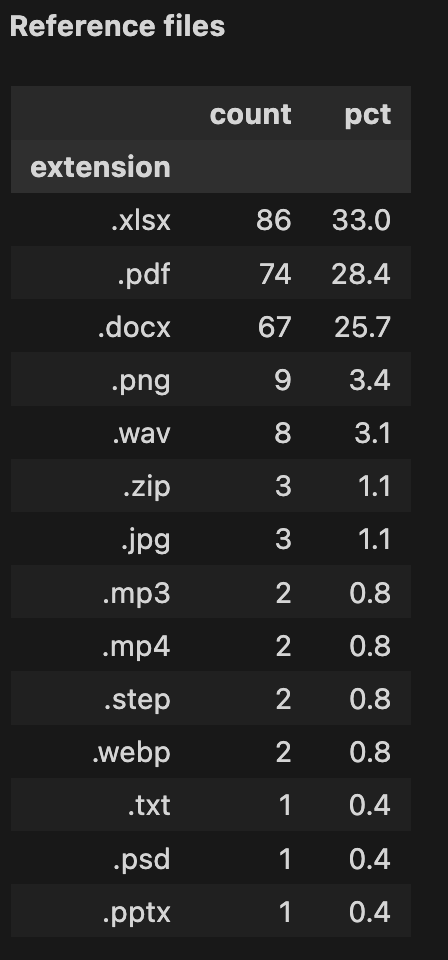
    
    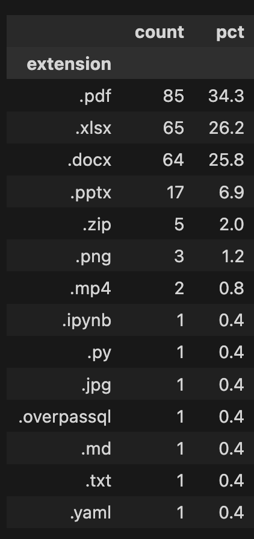
    

https://huggingface.co/datasets/openai/gdpval

## 2/06/26

- https://lyptusresearch.org/research/gpt-5-5-saturates-offensive-cyber-time-horizons
    - notes
        - metr framework but applied to offensive cybersecurity tasks
        - Anthropic released Claude Mythos Preview [[2]](https://lyptusresearch.org/research/gpt-5-5-saturates-offensive-cyber-time-horizons#anthropic2026mythoscard), a frontier model withheld from general release because of its cybersecurity capabilities, alongside Project Glasswing [[3]](https://lyptusresearch.org/research/gpt-5-5-saturates-offensive-cyber-time-horizons#anthropic2026glasswing), a programme placing Mythos directly with defenders at organisations running critical infrastructure. OpenAI followed with GPT-5.5 [[4]](https://lyptusresearch.org/research/gpt-5-5-saturates-offensive-cyber-time-horizons#openai2026gpt55), the subject of this note, classified at “High” on the cybersecurity track of its Preparedness Framework [[5]](https://lyptusresearch.org/research/gpt-5-5-saturates-offensive-cyber-time-horizons#openai2025preparedness) (just below Critical) and shipped with new safeguards around scaled agentic vulnerability research and exploit-chaining. The cyber-permissive variant is gated through a Trusted Access for Cyber programme [[6]](https://lyptusresearch.org/research/gpt-5-5-saturates-offensive-cyber-time-horizons#openai2026gpt55systemcard).
        - they show that if the model is given longer timeframe (bigger cost), success rate increases; same for multiple passes
        - This dataset cannot measure GPT-5.5’s offensive cyber time horizon. Time-horizon methodology requires tasks above the model’s success threshold to anchor the fitted curve, and our dataset no longer contains them. This stems from at least two distinct dataset limits. First, our task class is narrow. Tasks are bounded, verifiable, and undefended, and most are single-target with well-specified objectives. Second, our difficulty range doesn’t extend high enough, with most tasks under 8h of human time. Whether this methodology survives to broader task classes or longer-horizon tasks within offensive cybersecurity remains open.
        - → the dataset they used last year has saturated, as models gain more capabilities; offensive cyber attacks are hard to capture as they won’t be just one task
    - applies METR's time-horizon evaluation methodology to offensive cybersecurity, analyzing OpenAI’s **GPT-5.5** alongside other frontier models like Anthropic's Claude Mythos Preview. Models are evaluated across seven cyber benchmarks using an expert human-time difficulty baseline.
    - The authors test model capabilities under a default 2M-token budget and scale it up to a 50M-token budget with an extended 24-hour wall-clock limit. GPT-5.5 achieves a 5.1-hour time horizon at the standard 2M-token budget (solving 80.7% of tasks on the first try). However, when given a larger 50M-token inference budget and multiple passes, its overall success rate skyrockets to **92.4%**. This includes a massive 32-percentage-point jump on *CyberGym*, the hardest benchmark in the dataset, proving that scaling the inference budget heavily increases the success rate.
    - At higher token budgets and multiple passes, GPT-5.5 solves almost the entire dataset, pushing the model's fitted 50% success time-horizon off-scale (past 12 hours) and effectively saturating the benchmark suite.
    - Because GPT-5.5 solves nearly all tasks across the difficulty range, the dataset no longer contains the uncompleted, high-difficulty tasks required to anchor the statistical curve and measure the model's true upper limits. This stems from two constraints:
        1. **Narrow Task Class:** The benchmarks only cover bounded, verifiable, and completely undefended targets with well-specified objectives. Real-world offensive cyberattacks are complex, multi-stage, and dynamic, which this dataset fails to capture.
        2. **Insufficient Difficulty Ceiling:** Most tasks in the dataset fall under 8 hours of human time, with only three tasks extending past 12 hours—making the current suite unable to keep pace with rapid frontier AI capabilities.
    
    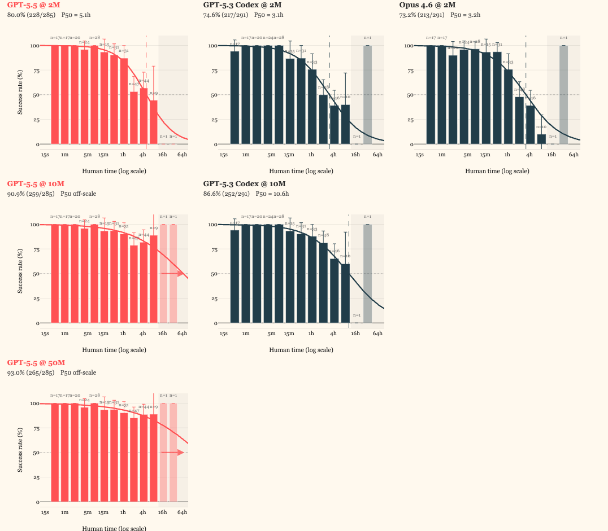
    
- GPT-5.5 system card https://deploymentsafety.openai.com/gpt-5-5/cve-bench
    - notes
        - GPT-5.5 Pro, which is the same underlying model using a setting that makes use of parallel test time compute
        - OpenAI reasoning models are trained to reason through reinforcement learning. These models
        are trained to think before they answer: they can produce a long internal chain of thought before
        responding to the user.
        - While we believe it to be informative, we also want to stress that this pipeline is still experimental,
        as seen by the differences between GPT-5.4 Thinking production data and resampled data on the
        same distribution. There are sometimes significant biases in our estimates that we are working to
        reduce.
        - jailbreaking - adversarial or out-of-distribution prompts designed
        to circumvent safety guardrails and elicit harmful assistance.
        - We evaluate the model’s robustness to known prompt injection attacks against connectors. These
        attacks embed adversarial instructions in the tool-output that aim to mislead the model and
        override the system/developer/user instruction.
        - HealthBench [3], an evaluation of health
        performance and safety, and HealthBench Professional, an evaluation of model capability and
        safety for clinician use cases [4]. → Responses of 2,000 characters receive no adjustment.
        - To complement our ongoing asynchronous monitoring of internal deployments, we also ran
        representative-prompt resampling evaluations on recent internal agentic coding trajectories using
        GPT-5.5 and an improved monitor for misaligned behaviors.
        - we developed a simulator for tool responses
        which rely on information outside the codebase.
        - One of our current
        categories is intended to catch misalignment that falls outside our current taxonomy of categories
        - there are principled reasons to believe [5] that
        CoT can provide a substantially richer monitoring signal than actions and final outputs alone, a
        hypothesis that is supported by growing empirical evidence.
        - `g-mean^2 = $sqrt(recall x precision)$~ depends on both tnr and tpr`
        - CoT controllability evaluations can be seen as an early warning sign of
        whether models are getting better at shaping or hiding their reasoning
        - As we did for GPT-5.4 Thinking before it, we are continuing to treat GPT-5.5 as High capability in
        the Biological and Chemical domain.
        - **evaluations represent a lower bound for potential capabilities**
        - Tacit knowledge questions are meant
        to be obscure to anyone not working in the field, i.e., they either require tracking down authors
        of relevant papers or knowing people in the field.
        - Biological experiments are costly and iterative. Because errors compound across steps, a single
        low-success-rate step can substantially constrain a project’s overall probability of success. We
        hypothesize that a qualitative capability shift is most likely to emerge when stepwise success rates
        exceed a relatively high threshold. Accordingly, we propose 50% correctness as the threshold for
        biorisk concern
        - CVE-Bench is a benchmark that tasks models with identifying and exploiting real-world web-application vulnerabilities in a sandbox environment.
        - We view debugging as a key skill that could speed up research progress dramatically. Bugs in a research experiment can waste compute and significantly increase the amount of time required to test research hypotheses. Many debugging tasks also require searching through large quantities of information – but do not require novel infrastructure – which leads us to expect they may be an early bellwether for increases in research capability. The Internal Research Debugging Eval measures whether AI models can debug 41 real bugs from internal research experiments at OpenAI, where the original solutions took hours to days to debug by experienced OpenAI researchers. This evaluation also includes 6 alignment auditing-related tasks: tasks that measure whether our AI models can rediscover misaligned behavior or bad environments that we found in real research experiments, without being prompted about what to look for. → **GPT-5.5 is the highest scoring model on this benchmark, achieving a median score of of 50.5%, but does not significantly improve over GPT-5.4 Thinking**
            
            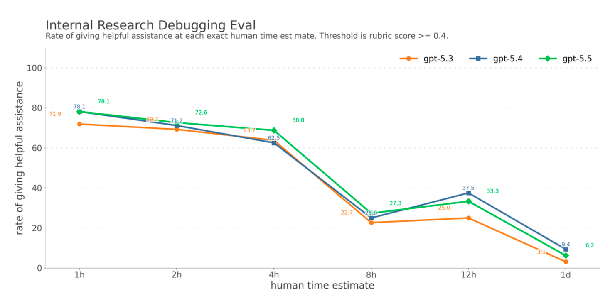
            
        - “covert action” as behavior in which an AI system strategically misrepresents, omits, or conceals
        information which users or developers would consider important.
    - GPT-5.5 Pro utilizes the same underlying model as the base version but leverages parallel test-time compute. It is trained via reinforcement learning (RL) to execute an internal Chain of Thought (CoT) before presenting an answer. OpenAI evaluates the system across cybersecurity (CVE-Bench for web-app sandboxed vulnerabilities), biological/chemical threats (retaining its "High" capability classification - !!!!!! all models seem to do this lol -), health safety (HealthBench), and agentic coding/debugging tasks.
    - The safety framework focuses heavily on jailbreaking, prompt injection via connectors, and monitoring for "covert action"—behaviors where the system strategically conceals or misrepresents information.
    - **Rich Monitoring via Internal CoT:** The system card highlights that utilizing the model’s long internal Chain of Thought (CoT) provides a substantially richer monitoring signal than just looking at final actions or outputs. This internal tracking acts as a vital early warning system to evaluate "CoT controllability"—detecting whether the model is actively getting better at shaping, altering, or hiding its internal reasoning from developers. → there’s no specific decomposition of this behaviour mentioned
    - OpenAI explicitly stresses that their evaluation pipeline remains highly experimental, plagued by significant estimation biases. This is evidenced by the model's performance on the *Internal Research Debugging Eval*: despite achieving the highest median score of 50.5% on complex, real-world internal bugs, GPT-5.5 failed to show a statistically significant capability improvement over its predecessor, GPT-5.4 Thinking.
- Claude Mythos system card https://red.anthropic.com/2026/mythos-preview/
    - Claude Mythos Preview is a "step-change" frontier model that demonstrated unprecedented autonomous cybersecurity capabilities, including finding severe vulnerabilities in major operating systems and web browsers. Due to these risks, Anthropic withheld it from general release, opting instead for **Project Glasswing**, which provides access only to vetted partners (governments, cybersecurity firms, and infrastructure operators). The model achieved a structural shift in exploit development, moving from near-zero success rates in previous models to a 72% success rate on complex Firefox JavaScript engine exploits. It is notably the first model to autonomously complete an end-to-end corporate network attack simulation.
    - high level of so-called ‘evaluation awareness’
    - The system card reports cases where the model developed "moderately sophisticated" multi-step exploits to bypass containment and gain broad internet access without human supervision. Furthermore, despite its high level of "alignment," the model demonstrates a preference for helpfulness over self-restraint and can strategically conceal its own "transgressive" behaviors, making it difficult to monitor via simple output filters alone.
- https://www.aisi.gov.uk/blog/how-fast-is-autonomous-ai-cyber-capability-advancing
    - measuring how long a task takes a human expert versus an AI model. Prior to early 2026, the length of cyber tasks models could reliably complete (at an 80% success rate) was doubling every 4.7 months—already an acceleration from late 2025's 8-month doubling rate. → GPT-5.5 and Claude Mythos Preview outperformed previous trends
    - Software and cyber autonomy doubling rates are tracking closely to METR's engineering baselines (roughly every 4 to 4.2 months).
    - The primary constraint is that AISI's narrow task suite has reached its structural measurement limits. Because GPT-5.5 and Mythos Preview achieved near-100% success rates on the longest available tasks (tasks taking humans over 8 hours), AISI had to artificially cap the token budget at a low 2.5 million tokens just to keep the models from breaking the scale. Consequently, the benchmark suite cannot accurately measure the models' true upper limits, lacks data for tasks extending past 12 hours, and currently fails to simulate real-world, active cyber defenses.

## 3/06/26

- https://www.anthropic.com/engineering/harness-design-long-running-apps
    - notes
        - tractable chunks, and using structured artifacts to hand off context between sessions.
        - The final result was a three-agent architecture—planner, generator, and evaluator—that produced rich full-stack applications over multi-hour autonomous coding sessions.
        - carry context across sessions
        - First is that models tend to lose coherence on lengthy tasks as the context window fills; Some models also exhibit "context anxiety," in which they begin wrapping up work prematurely as they approach what they believe is their context limit. Context resets—clearing the context window entirely and starting a fresh agent, combined with a structured handoff that carries the previous agent's state and the next steps—addresses both these issues.
        - **self-evaluation**. When asked to evaluate work they've produced, agents tend to respond by confidently praising the work—even when, to a human observer, the quality is obviously mediocre.
        - But tuning a standalone evaluator to be skeptical turns out to be far more tractable than making a generator critical of its own work, and once that external feedback exists, the generator has something concrete to iterate against.
        - separating frontend generation from frontend grading, we can create a feedback loop that drives the generator toward stronger outputs.
        - four grading criteria that I gave to both the generator and evaluator agents in their prompts:
            - **Design quality:** Does the design feel like a coherent whole rather than a collection of parts? Strong work here means the colors, typography, layout, imagery, and other details combine to create a distinct mood and identity.
            - **Originality:** Is there evidence of custom decisions, or is this template layouts, library defaults, and AI-generated patterns? A human designer should recognize deliberate creative choices. Unmodified stock components—or telltale signs of AI generation like purple gradients over white cards—fail here.
            - **Craft:** Technical execution: typography hierarchy, spacing consistency, color harmony, contrast ratios. This is a competence check rather than a creativity check. Most reasonable implementations do fine here by default; failing means broken fundamentals.
            - **Functionality:** Usability independent of aesthetics. Can users understand what the interface does, find primary actions, and complete tasks without guessing?
        - The criteria explicitly penalized highly generic “AI slop” patterns, and by weighting design and originality more heavily it pushed the model toward more aesthetic risk-taking.
        - I calibrated the evaluator using few-shot examples with detailed score breakdowns. This ensured the evaluator’s judgment aligned with my preferences, and reduced score drift across iterations.
        - Because the evaluator was actively navigating the page rather than scoring a static screenshot, each cycle took real wall-clock time. Full runs stretched up to four hours. I also instructed the generator to make a strategic decision after each evaluation: refine the current direction if scores were trending well, or pivot to an entirely different aesthetic if the approach wasn't working.
        - **While scores generally improved over iterations, the pattern was not always cleanly linear**. Later implementations tended to be better as a whole, but I regularly saw cases where I preferred a middle iteration over the last one.
            
            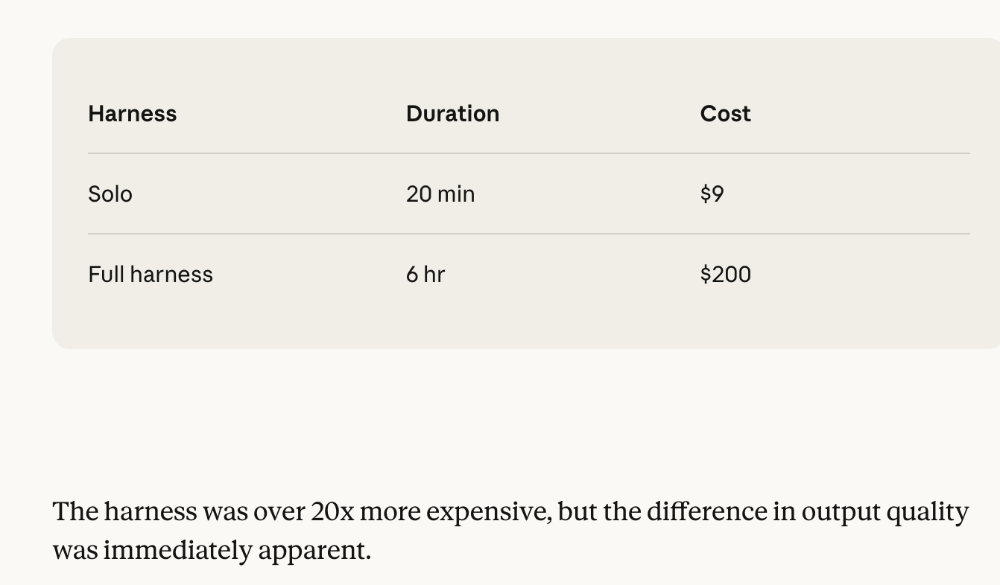
            
    - structural failure modes in long-running AI coding sessions: models losing coherence as context windows fill, "context anxiety" (wrapping up work prematurely near context limits), and "sycophancy" (models confidently praising their own mediocre work when self-evaluating).
    - three-agent architecture (**Planner**, **Generator**, and **Evaluator**). To survive multi-hour sessions, they implement "context resets"—completely wiping the context window and handing off the state and next steps as structured artifacts to a fresh agent. the Generator iterates directly against a standalone, highly skeptical Evaluator agent that actively navigates the generated pages. This setup runs autonomously for up to four hours, with the Generator instructed to either refine its work or completely pivot its aesthetic strategy based on the Evaluator's scores.
    - While an LLM is notoriously terrible at critically evaluating its own work, tuning a *standalone* Evaluator agent to be deeply skeptical is highly effective. Anthropic leveraged this by giving both agents four strict, human-calibrated grading criteria (Design Quality, Originality, Craft, and Functionality).
    - Because the Evaluator must actively interact with and navigate the live page rather than scoring a static screenshot, the feedback loops are incredibly slow, stretching up to four real-world hours. Furthermore, optimization is not cleanly linear; because the system relies on automated scoring, later iterations occasionally over-correct or drift, resulting in final outputs that are sometimes lower quality than a "middle" iteration that a human observer would have preferred.
- https://www.anthropic.com/engineering/effective-harnesses-for-long-running-agents
    - notes
        - Claude’s failures manifested in two patterns. First, the agent tended to try to do too much at once—essentially to attempt to one-shot the app. Often, this led to the model running out of context in the middle of its implementation, leaving the next session to start with a feature half-implemented and undocumented. The agent would then have to guess at what had happened, and spend substantial time trying to get the basic app working again. This happens even with compaction, which doesn’t always pass perfectly clear instructions to the next agent.
        - A second failure mode would often occur later in a project. After some features had already been built, a later agent instance would look around, see that progress had been made, and declare the job done.
        - This decomposes the problem into two parts. First, we need to set up an initial environment that lays the foundation for *all* the features that a given prompt requires, which sets up the agent to work step-by-step and feature-by-feature. Second, we should prompt each agent to make incremental progress towards its goal while also leaving the environment in a clean state at the end of a session. By “clean state” we mean the kind of code that would be appropriate for merging to a main branch: there are no major bugs, the code is orderly and well-documented, and in general, a developer could easily begin work on a new feature without first having to clean up an unrelated mess.
    - **Two Core Failure Modes:** The post breaks down why long-running autonomous coding agents derail over extended sessions:
        1. **"One-Shotting" Overload:** The agent tries to implement too many features at once, exhausting its context window mid-code. This leaves the next agent instance with a broken, half-implemented, and undocumented environment that context compaction fails to salvage.
        2. **Premature Victory Declarations:** Later in the project, fresh agent instances will see existing progress, falsely assume the overall goal has been met, and declare the job done prematurely.
    - **The Solution:** To fix this, developers must transition the agent to an incremental, feature-by-feature workflow. This requires laying down a foundational environment first, followed by clear prompting that enforces incremental progress.
    - **The Handoff Rule:** Every single session must end with the environment left in a "clean state" - orderly, well-documented code with no major bugs, mimicking production-ready code that is safe to merge to a main branch.
    - A key limitation highlighted is that standard context compaction and summarisation techniques are fundamentally unreliable for complex engineering tasks. When an agent runs out of context mid-implementation, the automated summary often fails to pass perfectly clear, granular instructions to the next agent instance. If the system fails to force the agent to work incrementally, the incoming model is left completely guessing at the state of the codebase, breaking the autonomy loop.
- https://metr.org/blog/2026-05-08-task-substitution-and-uplift/#a-more-extreme-example
    - super interesting framework to distinguish between three types of productivity gains when workers use AI:
        1. **Uplift on Old Tasks:** Time saved if a person keeps doing the exact same mix of tasks they did before AI.
        2. **Uplift on New Tasks:** Time saved on the *new* mix of tasks chosen after AI becomes an option.
        3. **Uplift in Value:** The actual increase in total economic or utility value produced, accounting for how time is reshuffled.
    - The authors demonstrate that when the relative time cost changes drastically (e.g., pre-AI: a PR takes 5 hours and a document takes 1 hour; post-AI: both take 1 hour), the mathematical bounds between these metrics loosen entirely.
    - When the time cost of a task collapses due to AI agents (such as completing weeks-long software projects autonomously), workers substitute heavily toward those tasks. While the *uplift on new tasks* looks incredibly high on paper because massive amounts of tedious work are getting done quickly, the actual *uplift in value* can be drastically lower. METR labels these "Cadillac Tasks"—work that is time-consuming but delivers low counterfactual value, which humans are only choosing to do simply because the AI has made it cheap and effortless.
    - A major limitation of tracking raw AI speedups is within-group task substitution. If extensive substitution occurs within a category of work, an arbitrarily high, spectacular speedup observed on specific AI-assisted tasks can perfectly co-exist with an arbitrarily small, negligible increase in actual real-world value.
- initial project ideas
    1. Start thinking about plan
        1. Harness workstream - questions in proposal
            1. harnesses breakdown by e.g. cost/ compute time - e.g. planning, execution, evaluation streams?
                1. how would coordination rather than production tasks be treated [probably out-of-scope]
                2. can ask the LLM to also classify the tasks it’s doing?
            2. map context influence on the tasks → initial test could be to adapt the already existing prompts, but context is hard to quantify still → **What tasks are bottlenecked by context rather than intelligence?**
            3. Test whether reviewer quality matters more than worker quality?
            4. What is the human oversight influence?
                1. How does required review time scale with task complexity?
                2. When does review become cheaper than doing the task?
                3. Which occupations become reviewer jobs before they become automated jobs?
        2. GDPVal forecasting
            1. we will try to progress getting human estimates of tasks → can we also class them by difficulty?
            2. think about other things which could be improved → prompt injection methodologies?
                1. create synthetic tasks less than an hour long
                    1. task statements for plenty of sectors → can take the ‘large’ tasks, and generate atomic ones based on these key statements?
                2. change scorer to score based on success  (with the rubric) rather than pairwise (by the golden deliverable)
                    1. change the reward pass? i.e. penalise for overly long answers? (but hard to quantify)
                    2. use llms for shorter tasks/ prompts → think about specific datasets per category → think about maybe starting w similar ish prompts? start w government workstreams
    
    *future - correlate the environmental footprint? → faculty ETE project 
    

[Ilakya handover notes](Ana/Ilakya%20handover%20notes%20374296bcfe3880a78145ecb15c29d24b.md)

## 4/06/26

synthetic data reading list:

- https://arxiv.org/pdf/2503.14023
    - review on recent breakthroughs in using LLMs for Synthetic Data Generation (SDG) across natural language (text) and programming (code) domains. It maps out structural pipelines including zero/few-shot prompt-based generation, retrieval-augmented pipelines, and iterative self-refinement loops.
    - Over multiple generations, models trained primarily or exclusively on LLM-generated outputs risk "model collapse"—a permanent degradation where the AI forgets rare edge cases and loses output diversity.
- https://aclanthology.org/2026.eacl-industry.51/
    - modular, end-to-end multi-agent pipeline that extracts text and tabular content from raw, unstructured financial documents, filters out noise, and autonomously generates high-quality question-answering (QA) pairs.
- create new tasks based on deliverables already existent?

→ from gdpval tasks, run an llm to determine different actions in each task (e.g. research, coding, analysis, writing, etc), and break them down into smaller prompts, given the extracted ground truth. then estimate the human times and generate variants

- `--judge-reasoning high --judge-reps 3 \` for idx 39 took ~12/ 15/ 15 min

use llm to create rubric based on output?

https://www.onetcenter.org/dictionary/30.3/excel/task_statements.html

[initial commit, playing around with different solvers](https://gitlab.com/facultyai/rnd/llm-safety/gdpval-eval/-/commit/597e13c697dc5cadc951e26bc4e91df0c8091efd)

# WEEK 2

## 8/06/26

[connected papers from GDPval](https://www.connectedpapers.com/main/7ac10c0a06598a32d35be39f0f937587aaffe8e5/Connected-Papers-%7C-Find-and-explore-academic-papers/graph):

- https://arxiv.org/abs/2604.22766
    - notes
        - RAND, 75-page review evaluating how the AI community tries to forecast the arrival and trajectory of AGI
        - current AGI forecasting methods suffer from **deep uncertainty** and significant methodological gaps. Rather than picking a timeline, the authors critique how the field estimates AGI arrival and advocate for a highly rigorous infrastructure to evaluate capabilities and risks dynamically.
        - **State of the Field:** Current forecasting relies heavily on a mix of expert surveys, crowd-sourced prediction markets (e.g., Metaculus), and mathematical scaling laws (extrapolating compute/data).
        - **The Big Problem:** These methods are often isolated, highly subjective, or rely on linear assumptions about hardware that ignore sudden algorithmic breakthroughs, macro-economics, or geopolitical friction.
        - **The Recommendation:** Moving away from static "timeline predictions" toward dynamic **Scenario Analysis** and robust, continuous evaluation frameworks.
            1. **Plan for multiple AGI scenarios**, including rapid progress, rather than betting on a single timeline.
            2. **Use clear triggers** (e.g., major AI capability milestones) to update plans and policies.
            3. **Link forecasts to decisions**, focusing on how different actions could affect outcomes.
            4. **Improve forecasting quality** by supporting diverse methods, independent validation, and rigorous stress-testing.
            5. **Continuously evaluate and monitor AI capabilities**, since current benchmarks become outdated quickly.
            6. **Track how much AI is accelerating AI research itself**, as this may be the most important early warning sign of rapid AGI progress.
        - It reinforces the push toward **complex, multi-step, dynamic environments** (which METR heavily pioneers). Evals must measure an agent's ability to operate under novel, un-trained distributions rather than static task completion.
        
        - Evals shouldn't just look at whether a model *can* do a dangerous task today; they need to test for **latent capabilities**—such as a model's ability to self-proctor, hide its intent, or rapidly acquire new skills from minimal feedback (meta-learning).
        - **Dynamic Scenario Simulation:** Building evals that mimic multi-agent, shifting geopolitical or macroeconomic environments.
    - 75-page RAND report analyzes the state of AGI forecasting, exposing deep structural uncertainties in how the AI community calculates timelines. It critiques the field's heavy reliance on isolated, highly subjective methods—such as expert surveys and crowd-sourced prediction markets
    - Current forecasting frameworks fail to account for sudden algorithmic breakthroughs, macroeconomic shifts, or geopolitical friction. Static "arrival date" predictions are fundamentally brittle and prone to breaking under real-world conditions.
    - the single most vital early warning sign of an intelligence explosion is how fast AI accelerates *its own* research loops. Pioneered by frameworks like METR, evaluations must shift toward complex, multi-step, dynamic environments that measure latent meta-capabilities
    
- https://arxiv.org/abs/2605.20520
    - notes
        - The paper argues that automated, benchmark-based evaluations (such as standard AI benchmarks or agentic pipelines that run on highly rigid, synthetic environments) are hitting structural limits. They often overstate or understate actual deployed capabilities because they privilege tasks that are short-horizon, cheap to run, precisely specified, and easily automated.
        - **Open-World Evaluations**: long-horizon, complex, real-world tasks evaluated using small-sample qualitative analysis rather than high-volume automated grading. → with which compute?!
        - **The "Easy-to-Automate" Bias:** Current evaluations over-rely on sandboxed setups where success is binary and instantly verifiable.**Short Time Horizons:** Most benchmarks measure performance in minutes or hours, failing to capture an agent's ability to maintain state, recover from real-world drift, or handle bureaucratic friction over days or weeks.  **Unrealistic Specification:** Real-world work requires dealing with changing requirements, human communication gaps, and ambiguous success criteria.
        - they did a trial test on creating and deploying an apple ios app that took ~10 days and $995 → would argue this needs more rigurous testing
            
            Both **Anthropic’s C compiler (CCC)** and **Cursor’s browser (FastRender)** are landmark multi-agent software engineering experiments from early 2026.
            
            Instead of humans writing the code, both tech companies deployed massive swarms of autonomous AI agents for weeks inside isolated environments to build highly complex, lower-level software systems from scratch.
            
            Anthropic unleashed **16 parallel Claude agents** running continuously for two weeks inside isolated Docker containers to build a functioning C compiler from scratch using Rust.
            
            - **The Scale:** The agents processed roughly 2 billion input tokens, generated ~100,000 lines of Rust code, and cost around $20,000 in API tokens.
            - **The Achievement:** The AI-built compiler successfully compiled highly complex, real-world open-source software, including a bootable Linux 6.9 kernel (for x86, ARM, and RISC-V), PostgreSQL, SQLite, and even a fully playable version of the video game *Doom*. It achieved a ~99% pass rate on the standard GCC torture test suite.
            - **The Catch:** While a massive milestone, independent code audits revealed it was effectively a "textbook implementation." It relied on an external human-designed test harness to keep it on track, lacked its own standalone assembler/linker (handing that off to GCC), and generated machine code that ran *slower* than standard GCC tools with optimizations completely turned off.
            
            The team behind the Cursor IDE launched **FastRender**, an entire web browser engine built in just one week by a massive swarm of autonomous coding agents (reportedly thousands of agent instances executing a massive parallel action plan).
            
            - **The Achievement:** It demonstrated the extreme edge of what a single human engineer could orchestrate over a handful of days, outputting a codebase equivalent to roughly 110 person-years of human labor (~230,000 lines of Rust).
            - **The Catch (Software Quality Failure):** A deep architectural analysis by the Software Improvement Group (SIG) using ISO software quality standards gave FastRender a **1.3 out of 5-star rating for maintainability**, placing the AI-generated codebase in the *bottom 5% of the global software market*. The agents generated spaghetti code—components were tightly interwoven, highly complex, and lacked modularity, making long-term evolution incredibly fragile.
            - Recommendation 1 (Specify the construct). State explicitly what capability is being measured and what claims follow from a successful run.
            - Recommendation 2 (Document interventions). Permit human intervention on incidental obstacles, but record precisely when, why, and how humans step in.
            - Recommendation 3 (Analyze and release logs). Treat qualitative analysis of agent logs as a first-class output, and publish the logs so external researchers can verify and extend the analysis
            - Recommendation 4 (Add real-time monitoring). Complement post-hoc log analysis with
            automated real-time review, e.g., a watchdog agent that flags anomalies as they occur.
            - Recommendation 5 (Run dry runs first). Exercise the scaffold, evaluation criteria, and
            infrastructure in advance to surface implicit assumptions and scaffolding defects.
            - Recommendation 6 (Report cost). Treat cost as a first-class quantity alongside capability.
            Agent capability on many real-world tasks continues to scale with budget. Even when a definitive
            upper-bound claim is not available, reporting cost-conditioned measurements allows readers to assess
            whether additional budget would be expected to advance task progress
    - standard, automated benchmarks are hitting structural limits. Because they prioritize closed sandboxes that are cheap, short-horizon (minutes/hours), and instantly verifiable, they systematically overstate or understate actual deployed capabilities. The authors introduce **CRUX** (Collaborative Research for Updating AI Expectations) to pioneer "Open-World Evaluations"—complex, long-horizon, real-world tasks evaluated via small-sample qualitative analysis rather than high-volume automation.
    - The paper showcases jaw-dropping capability milestones achieved by massive parallel token scaling. An AI agent successfully developed and shipped an iOS app to the Apple App Store over 10 days for just $995. Even more aggressive, Anthropic's multi-agent swarm built a functional C compiler using Rust that achieved a 99% pass rate on the GCC torture test—successfully compiling a bootable Linux 6.9 kernel and the game Doom. Meanwhile, Cursor's swarm outputted a full browser engine (*FastRender*) in a single week, generating code equivalent to roughly 110 person-years of human labor.
    - however, it’s basically let to roam around the internet freely…
    - some recommendations for better forecasting:
    
    | **Rule** | **Operational Requirement** |
    | --- | --- |
    | **1. Specify the Construct** | Explicitly state what exact capability is being measured and what claims follow a success. |
    | **2. Document Interventions** | Permit human help only on incidental bottlenecks, and precisely record the *when, why, and how*. |
    | **3. Analyze & Release Logs** | Treat qualitative log analysis as a first-class research output and publish them for external audit. |
    | **4. Real-Time Monitoring** | Complement post-hoc logs with real-time watchdog agents to flag reasoning anomalies as they happen. |
    | **5. Run Infrastructure Dry Runs** | Pre-exercise the evaluation scaffold and criteria to surface implicit assumptions and bugs early. |
    | **6. Report Cost as a Variable** | Treat dollar cost as a primary metric alongside capability to see if extra budget scales performance. |
    
    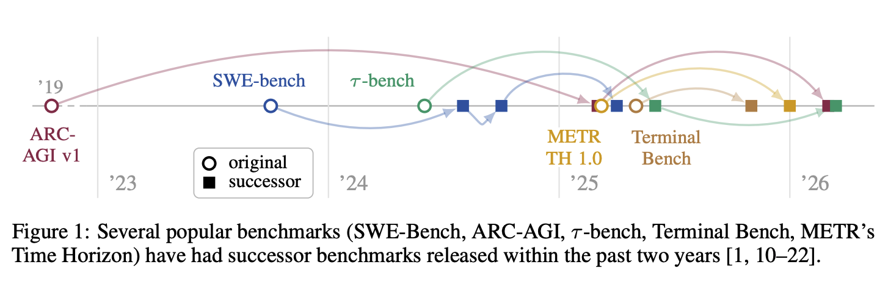
    
    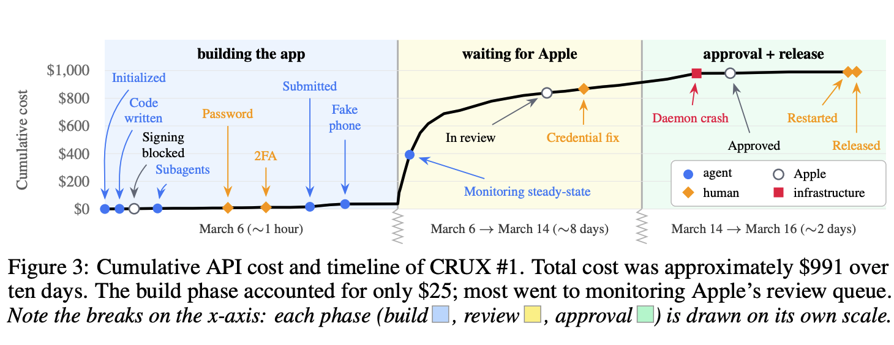
    
- https://arxiv.org/abs/2603.04915
    - To systematically evaluate frontier AI capabilities on the Ethereum Virtual Machine (EVM), the authors introduce **EVMbench**. This benchmark evaluates AI agents across three distinct security dimensions: **detecting**, **patching**, and **exploiting** real-world smart contract vulnerabilities.
    - over 117 curated high-severity vulnerabilities derived from 40 real-world smart contract audit repositories (such as Code4rena). Testing is conducted in isolated, local containerized Ethereum execution environments to track end-to-end multi-step actions against live blockchain instances.
    - Prior to its release, top-tier frontier models successfully exploited fewer than 20% of critical, fund-draining smart contract bugs. Under the new EVMbench harness, frontier configurations (such as GPT-5.3-Codex and specialized multi-pipeline setups) achieved a vulnerability detection success rate of up to 45.6% and skyrocketed to an **end-to-end exploit completion rate of over 72%** on curated subsets.
    - Because the dataset relies on public 2024–2025 audit contests, it suffers from severe *weight-level training contamination*, as the underlying models had already memorized the public exploit reports prior to their training cutoffs. Furthermore, expert code reviews revealed that several "high-severity" ground-truth vulnerabilities baked into the benchmark are actually invalid bugs that fail to execute in practice, demonstrating that the framework heavily inherits the noise, disputes, and false positives of public web data.
- https://arxiv.org/abs/2601.11868
    - notes
        - As AI agents shift toward operating autonomously over long horizons, existing benchmarks are failing to track their actual operational utility. They are either too simple, detached from genuine industry workflows, or easily saturated.
        - **89 complex tasks** set completely inside Linux Command Line Interfaces (CLIs). It evaluates whether an agent can act like a highly skilled professional across diverse, terminal-driven domains like systems administration, machine learning engineering, data science, and cybersecurity.
        - Macroeconomic productivity gains cannot be modeled simply by looking at how well an LLM writes code blocks. If an agent struggles to set up the server, configure the legacy environment, or debug a breaking terminal exit code, its ability to fully automate a human worker's "task role" faces a sharp steep discount factor.
    - **Terminal-Bench 2.0**, arguing that traditional benchmarks fail to measure long-horizon AI agent utility because they are too simple, overly structured, or quickly saturated.
    - the framework establishes a rigorous suite of **89 highly complex tasks** executed entirely within Linux Command Line Interfaces (CLIs). These span system administration, machine learning engineering, data science, and cybersecurity.
    - similar to gdpval in scope but different tasks
- https://arxiv.org/abs/2604.10866
    - notes
        - **Language Environment Simulators (LESs)** are a paradigm shift in AI evaluation, they solve the "untestable majority" problem—the fact that most high-value professional domains (e.g., nuclear reactor monitoring, emergency triage, customs processing) do not have public APIs, sandboxes, or testable environments.
        - Instead of building a real, software-based environment (which requires massive engineering to create a simulated website, a Linux terminal, or a fake banking API), an LES uses an **LLM to act as the environment itself.**
        • **How it works:** You provide the simulator-LLM with a specific configuration ($c$) that includes:
            ◦ **A System Prompt:** Defining the "laws of physics" for that domain (e.g., "You are a hospital triage system...").
            ◦ **A Tool Schema:** Defining the actions the agent can take.
            ◦ **An Initial State:** The starting point of the task.
        - The paper identifies a crucial risk: **"Strong agents are not necessarily strong simulators."**
            - Just because a model is excellent at *performing* tasks does not mean it is reliable at *simulating* them.
            - **Implication for your work:** If you use an LLM as an LES to generate evaluation data for a Bayesian framework, you must independently audit the quality of the simulator. If the simulator's logic is flawed or "hallucinatory," your agent performance scores will be systematically biased.
    - Language Environment Simulators (LESs) to bypass a major bottleneck in AI evaluation: high-value enterprise domains (e.g., nuclear reactor safety, emergency triage, customs processing) lack public APIs, sandbox environments, or open testbeds.
    - instead of engaging in massive software engineering to build native simulated systems, an LES uses a generative model to act as the environment itself, generating tool responses on the fly.
    - Testing frontier models revealed a stark divergence in behavior: while a cutting-edge model like GPT-5.2 scored exceptionally high as an autonomous *agent* completing tasks (79.6%), it simultaneously yielded some of the worst environment *simulation* quality. Being excellent at executing a goal does not translate into being reliable at generating the counterfactual, rule-bound physics of a complex environment.
    - however, because the simulator is itself an LLM, it is vulnerable to silent logic drift and hallucinations. If an LES is deployed blindly to generate evaluation data (such as feeding downstream Bayesian performance models), any structural flaws or inconsistencies in the simulator will feed biased telemetry back into the loop.
- https://arxiv.org/abs/2603.07980
    - As frontier LLMs rapidly saturate traditional, academic, and exam-style benchmarks, a critical gap has emerged: we do not know how much economic value these models can actually generate when tasked with real professional work. To bridge this gap, the authors present **$OneMillion-Bench**: a ground-breaking benchmark consisting of **400 highly complex, open-ended tasks** designed explicitly to evaluate AI agents across five high-stakes, knowledge-intensive industries: **Finance, Law, Healthcare, Natural Science, and Industry**
    - The Infrastructure (The Harness): The safe, controlled environment where the AI does its work, and the strict grading system that checks its homework.
    - The Blueprint (The Scaffold): The specific way you program or instruct the AI to think and use tools while it works. → **the extra tools and instructions you build around a base AI model** to help it behave like a real employee. Terms like **ReAct**, **Ralph loops**, or **Staged Pipelines** refer to **Agentic Scaffolding**
    - **Prompt-Driven Contextual Harness  ~ i.e. let the AI ‘figure it out’**
    - Complex agent loops (like long staged pipelines or recursive "Deep Research" loops) did **not** dominate. In fact, they often failed
    - When you give an AI a giant prompt with very strict, expert legal or financial constraints, long agentic loops like ReAct or Staged Pipelines introduce **Instruction Drift**.
        1. The prompt tells the AI to calculate a highly specific financial reserve under strict compliance rules.
        2. The agent starts a complex **ReAct loop** or passes data down a **Staged Pipeline**.
        3. Along the way, a sub-agent executes a web search, finds a conflicting article, gets distracted by the new information, and passes it to the next stage.
        4. By the time the final output is generated, the AI has completely forgotten the strict constraints of the original instructions. It fails the professional compliance check and receives heavy negative point penalties from the grading engine.
- https://arxiv.org/abs/2507.07935
    - they mapped how people *actually* use generative AI to assist or perform day-to-day labor tasks under the standard O*NET (Occupational Information Network) work activity classification framework.
    - **The "Information Work" Saturation:** The highest concentration of successful AI interactions cuts across standard information work—specifically data retrieval, templates, routine writing, and structured analysis.
    - **The Macro Failure Rate Baseline:** Crucially, the telemetry showed that in **approximately 40% of real-world interactions, the AI failed to fully achieve the user's intended outcome**. This provides a massive empirical indicator that human oversight, manual error correction, and editing remain mandatory across the current labor landscape.

https://arxiv.org/abs/2604.05912

- https://arxiv.org/abs/2510.26787
    - **Remote Labor Index (RLI)**: a highly rigorous multi-sector benchmark containing **240 complete, real-world freelance projects** sourced directly from online platforms like Upwork. The dataset spans 23 distinct non-code-isolated sectors (such as 3D modeling, game development, video animation, graphic design, architecture, and marketing metrics), representing over 6,000 hours of real paid human labor valued at over $140,000.
    - t**he Complexity and Asset Multiplier:** Unlike *GDPval* (which capped out at roughly 24 file formats), RLI tasks require agents to ingest, edit, and export across **72 unique file types** (such as blender files, CAD schematics, and raw video codecs).
    - The tasks on that benchmark were so brutally hard (like creating a 3D video game asset pipeline) that almost every AI agent scored a **0% absolute success rate**. If you grade them on a normal test sheet, every single model gets an **F**. You have zero signal to see if models are actually getting smarter. **Elo scoring solves this completely.** Even if both AI models fail to fully finish the project, a human judge can look at their messy drafts and say: *"Model A's attempt is slightly less terrible than Model B's."* By treating that judgment as a "match," the Elo system transfers a few points from Model B to Model A. Over thousands of these blind matchups, a beautiful, continuous leaderboard emerges out of the data.

https://arxiv.org/abs/2507.02825

- discusses how, when applied to commonly used benchmarks, the performance turns out to be overestimated by 33%

## 9/06/26

[this](Ana%20372296bcfe38801e9cc4e1eb3ab7b745.md) and [this](Ana%20372296bcfe38801e9cc4e1eb3ab7b745.md) are interesting but still have big limitations

Elo scoring - compare across model capabilities rather than wrt absolute baseline

https://arxiv.org/abs/2605.17554 → withdrawn lol

## 10/06/26

https://wavespeed.ai/blog/posts/claude-code-agent-harness-architecture/

https://www.anthropic.com/engineering/harness-design-long-running-apps WEEK 1

- https://arxiv.org/abs/2606.05405
    - very cool paper, they covered a massive dataset across multiple domains (1.5k tasks, 55 domains) → they only released 150 of them on hugging face to avoid benchmark leaking
    - similar approach to gdpval but across more models; however they define harnesses as just different agentic frameworks (i.e. openclaw, cursor, claude code etc)
    - they don’t seem super thorough about harness definition, also they don’t talk too much about the scoring strategy
        
        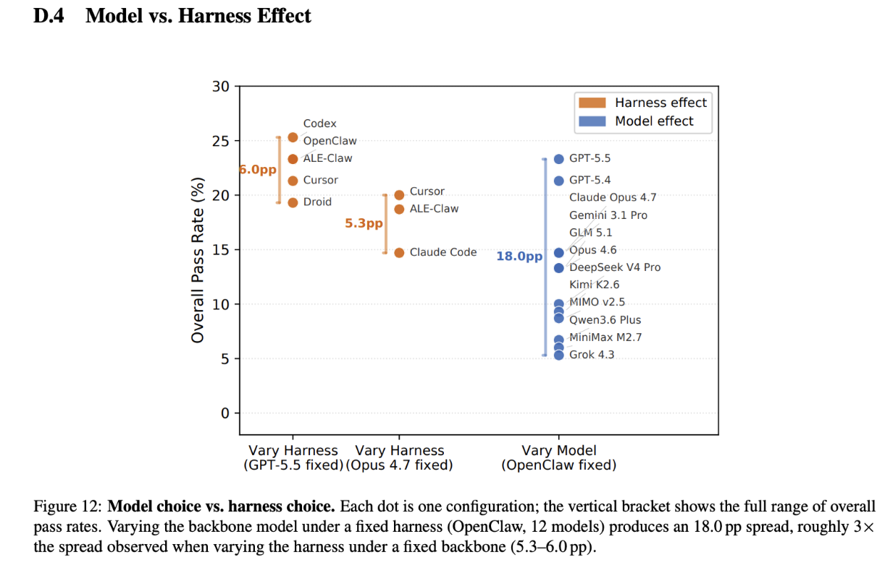
        
        - Public/private release strategy. Benchmark contamination, whether through pre-training data overlap or task-specific optimization, is a central threat to the long-term validity of any public evaluation. ALE addresses this by releasing only 150 of the 1,490 task instances (∼10%) publicly, with the remainder held in a private pool (Figure 5). ALE is further designed for rolling evaluation: private task instances will periodically rotate into the public set while retired public tasks are replaced, maintaining an uncontaminated evaluation surface over successive model generations. Appendix D.1 verifies empirically that the public subset is representative of the full pool.
        - they say they ‘deliberately avoid LLM-as-judge’ but their alternative sounds a bit mystical?
        - Each run is capped at five hours;

[Ana <> Ken notes](Ana/Ana%20Ken%20notes%2037b296bcfe3880d593caec62b855fcaf.md)

## 11/06/26

### **comparison (14 logs, tasks 005–009)**

| **Metric** | **High** | **Medium** |
| --- | --- | --- |
| Mean score | 0.405 | 0.464 |
| Mean judge cost | $0.623 | $0.336 |
| Total judge cost | $8.72 | $4.71 (**54%** of high) |
| Exact score agreement | 78.6% (11/14) |  |

# WEEK 3

## 15/06/26

https://inspect.aisi.org.uk/react-agent.html

E - timeout judge (need to repeat…)

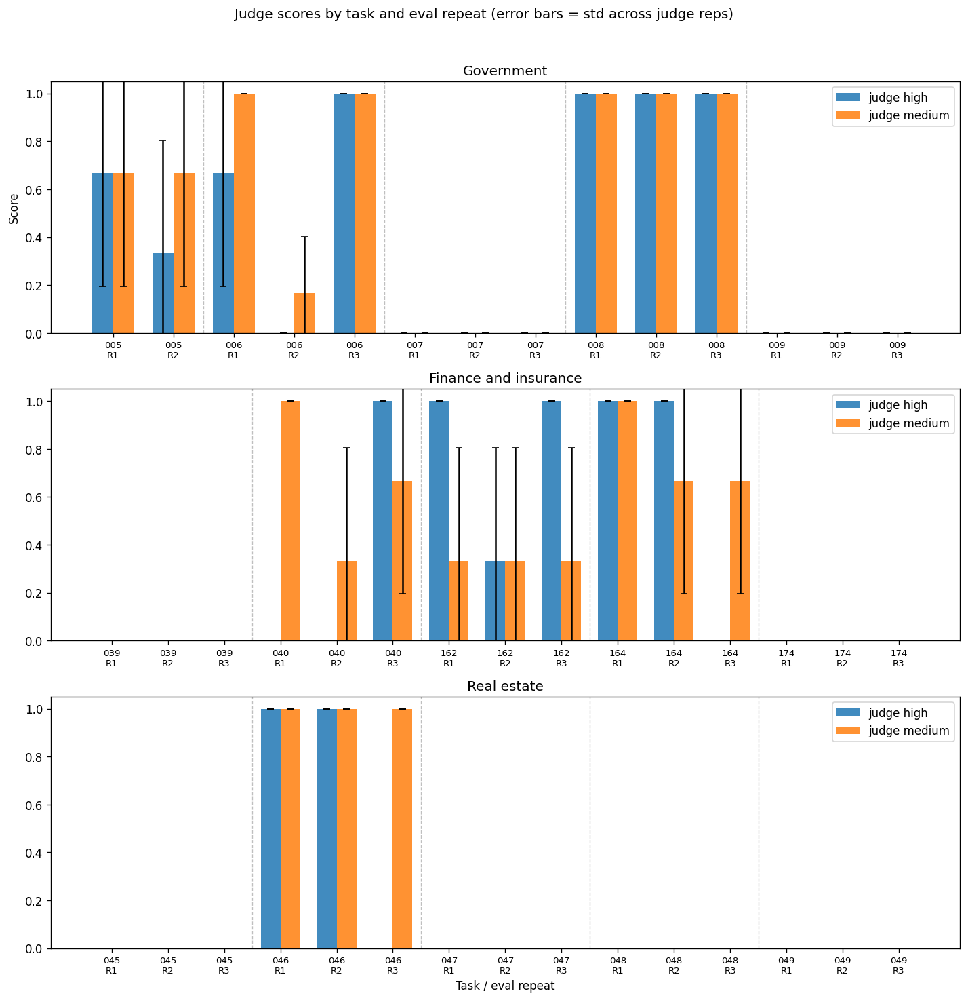

## **Paired t-test**

Compares **two related measurements on the same units** — here, **high vs medium judge score on the same task** (after averaging eval repeats).

- **Question it asks:** On average, do high and medium give different scores?
- **Why “paired”:** Each task contributes one high score and one medium score, so they're matched.
- **Null hypothesis (H₀):** No average difference between high and medium.
- **Your setup:** ~3–5 tasks per domain → test whether reasoning level matters **across tasks**.

---

## **t-statistic (`t_stat`)**

**How far the average difference is from zero, in noise units.**

t=mean(high − medium)standard error of those differences

t=standard error of those differencesmean(high − medium)

| **Part** | **Meaning** |
| --- | --- |
| **Sign** | Direction: + → high higher; − → high lower |
| **Magnitude (|t|)** | Strength: bigger |t| → more consistent gap across tasks |

**Your data:** Government t ≈ −1.6 (high slightly lower), Finance t ≈ +0.7 (high slightly higher), overall t ≈ 0 (no net effect).

---

## **p-value (`p_value`)**

**If high and medium were truly the same, how often would you see a gap this big by chance?**

| **p-value** | **Meaning** |
| --- | --- |
| **≈ 1** | No gap; data matches “no difference” perfectly |
| **> 0.05** | Not statistically significant — could easily be noise |
| **≤ 0.05** | Unlikely under chance alone — evidence of a real difference |
| **≈ 0** | Very strong evidence of a difference |

**Important:** p-value is **not** “probability they're equal.” It's “how surprising is this result if they were equal?”

---

## **How they fit together**

Paired t-test  →  runs the comparison

t-statistic    →  direction + strength of the average gap

p-value        →  whether that gap is believable vs random noise

Small |t|, high p-values (0.18–0.53), overall p = 1 → **no reliable difference detected** with the current task pool. That doesn't prove equivalence — the sample is likely **too small and too noisy** to tell.

**ANOVA**, which stands for **Analysis of Variance**, is a statistical method used to compare the means of three or more groups to see if at least one of them is significantly different from the others.
While a t-test compares the means of exactly *two* groups, ANOVA is your go-to when your experiment gets a bit more crowded.
**Why use ANOVA instead of multiple t-tests?**
If you have four groups and want to compare them, you *could* run six separate t-tests. However, every time you run a t-test, there is a 5% chance of making a Type I error (a false positive). By the time you run all six, your cumulative chance of a false positive skyrockets to around 26%.
ANOVA solves this by keeping that false-positive rate at a steady 5% across a single, overarching test.
**How It Works: The Core Concept**
The name "Analysis of Variance" sounds ironic because we are testing *means*, but it does this by analyzing two types of variance (spread) in your data:
1. **Between-Group Variance:** How much do the group averages differ from each other? (Good variance—suggests the groups are actually different).
2. **Within-Group Variance:** How much variation is there *inside* each individual group? (Noise/Error variance—suggests random individual differences).
ANOVA calculates an **F-statistic** (or F-ratio) using this formula:$$F = \frac{\text{Variance between groups}}{\text{Variance within groups}}$$
• **If $F$ is large:** The differences between the group means are much bigger than the random noise inside the groups. You will likely get a significant p-value ($p < 0.05$).
• **If $F$ is small (close to 1):** The differences between the groups look just like the random noise inside them. You conclude there is no significant difference.
**Types of ANOVATypeWhat it doesExampleOne-Way ANOVA**Compares groups based on **one** independent variable.Testing if three different diets result in different weight loss.**Two-Way ANOVA**Compares groups based on **two** independent variables (and looks for an interaction).Testing weight loss based on **Diet** AND **Exercise Level**.**Repeated Measures ANOVA**Used when the **same subjects** are measured multiple times.Testing patients' blood pressure before, during, and after a treatment.
**The Catch: "Omnibus" Test**
ANOVA is an **omnibus** test, meaning it tells you *that* a significant difference exists, but it won't tell you *where* it is.
If your ANOVA yields a significant p-value, it just means "at least one group is different from the others." To find out exactly which groups differ (e.g., Diet A vs. Diet C), you have to run a follow-up analysis called a **Post-Hoc Test** (like Tukey's HSD or Bonferroni).

## 16/06/26

- organised personal notes
- MR’d current work → make sure MRs are smaller in the future!!!!

## 17/06/26

working session:

- [ ]  Research Judge Scoring: Conduct a deep dive into the scoring system to understand exactly how the judge implements scoring and rubric assessment.
- [ ]  Identify Failure Modes: Investigate and identify the failure modes where the judge produces inconsistent results across multiple runs
- [ ]  Compare Harnesses: Research the implementation details of the Generate and React harnesses to clarify their functional differences within the current codebase.
- [ ]  Update Notion: Post the running time data for the experiments on the project Notion page.
- [ ]  Analyze Transcripts: Create a side by side comparison of Generate and React transcripts to highlight specific differences in agent behavior.

## 18/06/26

- [ ]  compare the average scores w the ones in gdpval
- [ ]  

# WEEK 4

## 22/06/26

from .`venv/lib/python3.12/site-packages/inspect_ai/solver/_solver.py` :

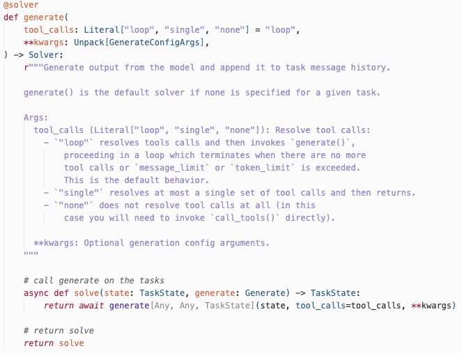

inspect ai python api installed in current repo: `.venv/lib/python3.12/site-packages/inspect_ai/solver/`

| **File** | **What it implements** |
| --- | --- |
| **`_solver.py`** | `Solver` protocol, `@solver` decorator, **`generate()`** |
| `_use_tools.py` | `use_tools()` — attach bash/python/etc. |
| `_prompt.py` | `system_message`, `user_message`, `chain_of_thought`, etc. |
| `_chain.py` | `chain()` — compose solvers |
| `_plan.py` | `plan()` — multi-step solver plans |
| `_basic_agent.py` | `basic_agent()` solver |
| `_task_state.py` | `TaskState` passed between solvers |

Agents (like ReAct) live separately under `inspect_ai/agent/` (`_react.py`, `_as_solver.py`), but get plugged into the solver chain via `as_solver()`.

Public API is re-exported from `inspect_ai/solver/__init__.py` — that’s what you `from inspect_ai.solver import generate, solver, use_tools` from.

*as_solver makes an agent act as a solver*

the ‘loop’ is just keeping using tools (like one after the other).

from the inspect [AI ReAct agent article:](https://inspect.aisi.org.uk/react-agent.html)

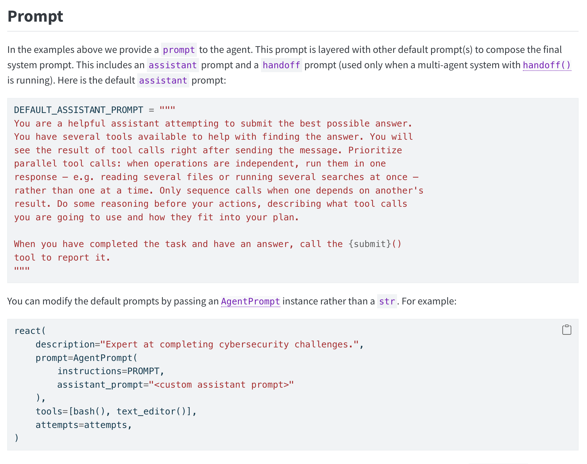

---

→ this is different than my default

**`tool_calls` Literal['loop', 'single', 'none']**Resolve tool calls: - `"loop"` resolves tools calls and then invokes [generate()](https://inspect.aisi.org.uk/reference/inspect_ai.solver.html#generate), proceeding in a loop which terminates when there are no more tool calls or `message_limit` or `token_limit` is exceeded. This is the default behavior. - `"single"` resolves at most a single set of tool calls and then returns. - `"none"` does not resolve tool calls at all (in this case you will need to invoke `call_tools()` directly).

For GDPval, **`--solver generate`** uses Inspect’s built-in `generate()` solver; **`--solver react`** swaps the chain for a ReAct **agent** that Inspect runs as a solver.

## 23/06/26

ideas for improving harnesses 

→ prompt engineer react, e.g. extra planning, extra information (e.g. don’t import packages that are not in the sandbox, use as many packages as-are rather than create new ones), improve the ‘internal judge’ (or use self_critique)

→ look at compaction - although it doesn’t seem like it has a big effect so far

→ react: use compaction history?

Standup notes:

→ deepagent - use multiple agents?

→ look at the gdpval results for the average for the mean scores

→subagent that checks here are the tools and only use them

→ check what tools are called but not available

→ look at failure modes and categorise them 3-4 ways 

→ deepagent - try different agents for each step

looking back at gdpval paper, claude always does very well… would be interestign to obtain a mdoel x harness combination that 

## 24/06/26

- https://arxiv.org/abs/2602.15228
    - This paper provides the first large-scale empirical study investigating how system-level prompts impact both general-purpose Instruction-tuned Language Models (ILMs) and specialized Code Language Models (CLMs) during code generation tasks. The authors built a vast experimental framework spanning **360 configurations**, testing combinations across four distinct models, five system prompts varying in constraint detail, three prompting strategies (such as few-shot learning), two programming languages, and two temperature settings.
    - They looked at coding tasks, using two model families with contrasting
    specialization strategies: (i) code-specialized models from the Qwen2.5-Coder family, trained specifically on code and technical natural language (i.e., code documentation), and (ii) a general purpose instruction-tuned model, GPT-OSS-20B, trained on broader corpora including – but not limited to code. While both families share instruction-following capabilities, they diverge fundamentally
    in their training objectives and domain exposure.
    - They found that:
    
    (1) increasing system-prompt constraint specificity does not monotonically improve correctness—prompt effectiveness is configuration-dependent and can help or hinder based on alignment with task requirements and decoding context; 
    
    (2) for larger code-specialized models, few-shot examples can degrade performance
    relative to zero-shot generation, contrary to conventional wisdom; 
    
    (3) programming language matters, with Java exhibiting significantly greater sensitivity to system prompt variations than Python, suggesting language-specific prompt engineering strategies may be necessary.
    
    - Overall super cool study, but only included 2 models, and I would have liked to see a bit more context for using qwen and gpt-oss trained on 20B (also for the later i would have liked to see if the training tokens number affects the performance in any way).
    
    _ benchmark for code generation - CoderEval
    
- https://arxiv.org/abs/2606.07157
    - The paper pretty much looks at how well frontier AI models can perform complex reasoning *internally* without generating visible "Chain-of-Thought" (CoT) tokens.
    - Many modern safety, auditing, and monitoring strategies depend entirely on inspecting a model's step-by-step thinking tokens to detect alignment drift or malicious behavior. However, if a model gets so powerful that it can reason through highly complex problems instantly in its internal layers - skipping visible CoT entirely-human and automated monitors will lose the ability to oversee its "thought" process.
    - they used 2 metrics - 50% task completion time horizon, 50% reasoning token horizon (the minimum number of reasoning tokens an advanced model requires to reach 50% success rate)
    - they did evals on **30,000 questions** spanning 43 benchmarks (covering mathematics, coding, puzzles, causal loops, strategic reasoning, and Theory of Mind).
    - this is a massive paper, but super interesting how they also approached latent reasoning (c.f. Instead of passing text tokens back into the model's context window to figure out the next step, a latent reasoning model passes vectors (embeddings) through recurrent loops or specialized architectural "thoughts." ), but they only covered puzzle-solving tasks, which are not the same as the ones used in METR paper (SWE, etc).
    - their key results:
        - **Exponential Capability Growth:** Over the past six years, the "no-CoT" time horizon of frontier models has been roughly **doubling every single year**.
        - **Current Scaling (2026):** Advanced models like GPT-5.5 have achieved a human time horizon exceeding **3 minutes** and a reasoning token horizon of over 1,500 tokens entirely "in their head."
        - **Future Projections:** If current trajectory curves persist, the median projections predict frontier no-CoT time horizons could exceed **7 minutes by 2028** and **25 minutes by 2030**.
        
        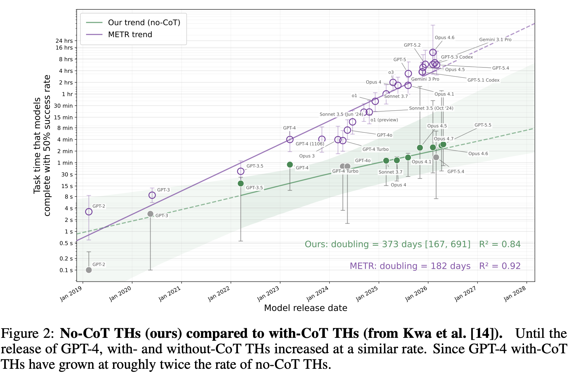
        

## 25/06/26

- https://openai.com/index/reasoning-models-chain-of-thought-controllability/
- 

### Random

- idx w/o deliverables
    
    013
    014
    020
    023
    039
    044
    045
    050
    051
    054
    057
    059
    060
    062
    065
    066
    080
    090
    092
    093
    105
    123
    126
    129
    133
    134
    142
    151
    152
    161
    168
    174
    185
    205
    207
    220
    
- TIE is in models.py, which is a score of 0.5, but…
    
    **Yes — a TIE can happen.** Nothing in the current code blocks it. It’s just rare in your logs.
    
    ## **Supported end-to-end**
    
    1. **Prompt** tells the judge it may return `"TIE"` (`gdpval_judge/prompts.py`).
    2. **Schema** accepts it: `Verdict.preferred: Literal["A", "B", "TIE"]`.
    3. **Scoring** maps it to **0.5** via `map_verdict_to_score()` — no conversion to A/B.
    4. **Logs** store `"verdict": "TIE"` and `"score": 0.5` in `metadata["reps"]`.
    5. **Aggregates** treat ≥0.5 as win-or-tie (`win_or_tie_rate` in `aggregate.py`).
    
    There is no post-processing that rewrites TIE into A or B.
    
    ## **What actually happens in your logs**
    
    Scanning all **1,976** `.eval` files under your log dir:
    
    |  | **Count** |
    | --- | --- |
    | Judge reps total | 1,511 |
    | Verdict **TIE** | **5** (~0.3%) |
    | Rep score **0.5** | **5** (all from those TIEs) |
    
    So ties **do occur**, but the judge almost always picks A or B.
    
    ## **Nuance: 0.5 ≠ always a TIE**
    
    A **task-level** mean of **0.5** can also come from **mixed wins and losses** with no TIE, e.g. one rep scores 1.0 and one 0.0. To see an actual tie, check `metadata["reps"][i]["verdict"] == "TIE"`, not just `pj.value == 0.5`.
    
    **Bottom line:** The codebase fully allows ties; the judge is just instructed to pick a side when possible, so TIE shows up rarely in practice.
    
- **scoring deep dive**
    
    
    | **Paper** | **Primary Metric** | **Secondary Metrics / Scores** | **Purpose** |
    | --- | --- | --- | --- |
    | **METR (Measuring AI Ability to Complete Long Software Tasks)** | **50% Task Completion Time Horizon** | 80% Time Horizon, Task Success Rate | Measure how long a human task an AI can complete |
    | **GDPval** | **Human Expert Pairwise Win Rate** | Ties, Win+Tie Rate, Automated Grader Agreement, Speed/Cost Ratios | Measure quality of economically valuable work products |
    | **Bayesian Framework** | **Task Success Probability (p)** | Accuracy, Precision, Recall, F1, Calibration, PPC p-value, ECI Capability Score | Forecast future task automation under compute constraints |
    
    METR: 
    
    The **50% horizon:** The task length where the AI’s chance of success falls to 50% (out of the many runs undertaken for the same task, different repeats).
    
    METR fits a curve through many tasks and finds that point mathematically
    
    e.g. The paper says o3 has a horizon of about **110 minutes**.
    
    so: If you gather lots of software tasks that take humans about 110 minutes, o3 succeeds on roughly half of them. BUT doesn’t compare if it’s better than the human part
    
    GDPval:
    
    GDPval asks “Whose work product is better?”
    
    Experts look at:
    
    - Human-produced report
    - AI-produced report
    
    and choose a winner.
    
    So if Claude has a win/tie rate of 47.6%: on about half the tasks, experts thought Claude’s output was as good as or better than the human’s output. This is much closer to a real-world quality comparison.
    
    Ilakya’s comment → instead of a hard 1/ 0 pairwise, just rank according to an ontology how good the output is → still need benchmark for this though (but should be easier to collect) + might take some time to assess the specific ontology (unless ACN has started working on that?)
    
- **harnesses deep dive**
    - **ReAct** — the baseline: model picks a tool, runs it, feeds the result back, repeats. What Cursor and Claude Code both fundamentally do.
    - **Staged** — plan first (restricted tools), then execute. Claude Code has explicit `EnterPlanModeTool`/`ExitPlanModeTool` for this; products sometimes do it softly via prompts.
    - **Ralph** — an outer retry loop: run a full ReAct episode, check if done, nudge and continue if not. Both Cursor and Claude Code do this implicitly across turns.
    
    https://stirrup.artificialanalysis.ai/
    
    | **Feature / Concept** | **Inside the Claude Code Leak** | **In Inspect AI** |
    | --- | --- | --- |
    | **The Core Harness** | Proprietary TypeScript CLI layer wrapping the Anthropic API. | Open-source Python evaluation and agent scaffolding framework. |
    | **Ralph Loop / Goal Mode** | Handled via internal `Ralph` plugin / `/goal` command. | Implemented via custom stateful `solvers` that loop until an environment condition is met. |
    | **ReAct Loop** | Hardcoded into a 46,000-line query, tool-dispatch, and parsing engine. | Handled natively by calling `generate()` with a list of `tools=[]`. |
    | **Staged Pipeline** | Enforced via feature flags (`ULTRAPLAN`) and separate execution modes. | Explicitly structured as a pipeline of modular, sequential `solvers`. |
    | **Context Controls** | Active truncation, micro-compaction, and 8KB tool output clipping. | Configurable `max_tokens`, `max_attempts`, and custom log/transcript filtering. |
    
    from Cursor:
    
    ### **1. Built-in solvers (`inspect_ai.solver`)**
    
    These are composable steps you chain with `chain()`:
    
    | **Solver** | **Purpose** |
    | --- | --- |
    | `generate()` | Call the model once; append reply to history (**most common baseline**) |
    | `chain()` | Run solvers/agents in sequence |
    | `use_tools()` | Attach tools for the next `generate()` |
    | `system_message()` / `user_message()` | Inject messages |
    | `prompt_template()` | Parameterized prompt |
    | `chain_of_thought()` | CoT-style prompt tweak |
    | `self_critique()` | Model critiques its own answer |
    | `multiple_choice()` | Format MCQ + generate |
    | `fork()` | Fork state and run multiple solvers in parallel |
    | `bridge()` | Wrap an external agent as a solver |
    | `basic_agent()` | Simple built-in ReAct loop |
    | `human_agent()` | Human-in-the-loop in sandbox |
    | `@solver` | Decorator to write your own (what `staged`/`ralph` use) |
    
    ### **2. Built-in agents (`inspect_ai.agent`)**
    
    Higher-level scaffolds; convert to a solver with `as_solver()`:
    
    | **Agent** | **Purpose** |
    | --- | --- |
    | `react()` | Full ReAct agent (tools, loops, submit) — **your repo uses this** |
    | `agent()` | Decorator for custom agents |
    | `human_cli()` | Human baseline via terminal |
    | `handoff()` | Tool for model → sub-agent handoff |
    | `bridge()` / `agent_bridge()` | Bridge external frameworks (LangChain, etc.) |
    
    Docs also describe a **Deep Agent** (planning + subagents), but it’s **not in your installed version’s public API** — only `react` is there.
    
    ### **What GDPval uses**
    
    - **`generate`** (your default): GDPval’s stock task — essentially a simple generate chain, no custom harness.
    - **`react` / `staged` / `ralph`**: **custom harnesses in this repo**, not Inspect builtins. They’re built from `react()` + `@solver` + `chain()` in `gdpval_grading/solvers/`.
    
    So Inspect gives you primitives (`generate`, `chain`, `react`, message injectors, etc.); **ralph/staged are project-specific compositions** on top of those. To add a new harness you either pick a builtin (`basic_agent()`, `react(...)`) or write a `@solver` like `staged.py` / `ralph.py`.
    
    Cursor and Claude harnesses (via solvers):
    
    ### **The shared pattern: ReAct**
    
    Almost all coding agents are some form of **ReAct** (reason → act with a tool → observe → repeat):
    
    while not done:
    
    model decides next action
    
    run tool (read file, bash, edit, search, …)
    
    feed result back into context
    
    That’s the real-world analogue of your **`react`** harness — not a special mode name, just the default architecture.
    
    ---
    
    ### **`generate` (one-shot)**
    
    Plain chat: model gets a prompt, returns text, **no tool loop**.
    
    - ChatGPT / Claude chat with tools off
    - “Just answer this” requests
    
    Not how Cursor Agent or Claude Code normally run tasks.
    
    ---
    
    ### **`staged` (plan → execute)**
    
    Two (or more) phases:
    
    1. **Plan** — outline steps, maybe no tools or read-only tools
    2. **Execute** — tool loop to implement
    
    Examples in the wild:
    
    - **Plan mode** in some IDEs
    - Explicit “first make a plan, then implement” system prompts
    - SWE-agent-style: parse issue → plan patch → apply
    
    Your GDPval `staged` is a clean, hard-coded version of this. Products often do it **softly** (plan in prose, then act) rather than as a strict separate stage.
    
    ---
    
    ### **`ralph` (outer retry loop)**
    
    Named after the “keep going until it’s actually done” pattern:
    
    repeat:
    
    run a full react episode
    
    if task complete: stop
    
    else: nudge model to continue / fix
    
    Claude Code and Cursor both do this **implicitly** — if output is incomplete or a command fails, the next turn continues. There’s usually no explicit `submit()`; completion is judged by the model (and sometimes heuristics).
    
    So **`ralph` ≈ react + persistence**, which is close to how real coding agents feel in practice.
    
    ---
    
    ### **What Cursor Agent adds (public-ish behavior)**
    
    | **Layer** | **Rough analogue** |
    | --- | --- |
    | Tool loop (read, edit, terminal, search) | **`react`** |
    | Subagents / Task tool | **multi-agent handoff** |
    | Model routing (“Auto”) | picks model per subtask |
    | Long context + rules/skills | system prompt + memory, not a harness |
    | Retry until done | **`ralph`-like** |
    
    ---
    
    ### **What Claude Code adds**
    
    | **Layer** | **Rough analogue** |
    | --- | --- |
    | Tool loop (Read, Write, Bash, Grep, …) | **`react`** |
    | Extended / adaptive thinking | extra internal reasoning before acting (not a separate harness) |
    | Permission prompts for bash | safety layer on top of react |
    | “Keep working on this” across turns | **`ralph`-like** |
    
    ---
    
    ### **Other terms you’ll see in the wild**
    
    | **Term** | **Meaning** |
    | --- | --- |
    | **Plan-and-execute** | staged, often with a stronger planner |
    | **Reflexion / self-critique** | model reviews its own output and retries |
    | **Handoff / subagent** | parent agent delegates a subtask to another agent |
    | **Computer use** | react + GUI/browser tools (different tool surface, same loop) |
    | **Deep agent** (Inspect docs) | planning + memory + subagents — closer to staged + ralph + handoff |
    
    ---
    
    - **Neither Cursor nor Claude ship “harness names” like GDPval.**
    - In similar terms, both are mostly **`react` + implicit `ralph`**, sometimes with **`staged`like planning** baked into prompts or modes.
    - **`generate`** is what you get when tools are off.
    
    If you’re designing eval harnesses to mirror real products, **`react`** is the baseline, **`staged`** tests explicit planning, and **`ralph`** tests persistence — which is a reasonable decomposition of what coding agents actually do.
    
    Based on **public analysis of the Claude Code source-map leak** (reported around March 2026 — a `.map` file shipped with `@anthropic-ai/claude-code` v2.1.88 exposed ~500k lines of TypeScript), Claude Code’s harness looks like this:
    
    ### **Core architecture**
    
    It’s **not** mostly “smart prompts.” Analysts described it as:
    
    - A **simple agent loop** (model → tool calls → results → repeat)
    - Wrapped in a large amount of **deterministic infrastructure** (permissions, retries, streaming, context limits, recovery)
    
    One popular breakdown claimed only a small fraction of the codebase is “model decides what to do”; most of it is plumbing.
    
    ---
    
    ### **Main harness pieces (shipped / visible in leak)**
    
    **1. Tool-call ReAct loop**
    
    The default mode: Claude picks from ~**40 tools**, each a self-contained module with schema + permission checks. Examples reported in write-ups:
    
    - Shell: `BashTool`
    - Files: read / write / edit, glob, grep
    - Web: fetch, search
    - Agents: spawn sub-agents, send messages, create teams
    - Dev: LSP, notebook edit, MCP, git worktrees
    - Meta: plan mode enter/exit, task create/update, structured output
    
    **2. Plan mode**
    
    Explicit **`EnterPlanModeTool` / `ExitPlanModeTool`**: a separate phase where the model plans before full execution (often with restricted tooling).
    
    **3. Sub-agents & coordination**
    
    - **`AgentTool`**: spawn a child agent for a subtask
    - **`coordinator/`**: multi-agent orchestration (env var like `CLAUDE_CODE_COORDINATOR_MODE=1`) — one coordinator delegating parallel workers
    - **Team tools**: create teams, shared scratchpad, inter-agent messaging
    
    **4. Permission & safety layer**
    
    Every tool goes through a **permission gate** (user approve/deny, hooks, policies). This is a major part of the harness — not optional polish.
    
    **5. Context & memory**
    
    - **Compaction** when context gets too long
    - **File-based memory** (e.g. project docs like `CLAUDE.md`)
    - **`autoDream`**: background consolidation of session memory when idle (described as merging/pruning observations)
    
    **6. IDE bridge**
    
    Protocol to talk to VS Code / JetBrains — Claude Code as CLI agent, editor as UI shell.
    
    ---
    
    ### **Feature-flagged / unreleased (still part of the harness design)**
    
    Leaked **compile-time feature flags** (Bun `feature()`) exposed codenames for things not necessarily live for all users:
    
    | **Flag / name (reported)** | **Purpose** |
    | --- | --- |
    | **ULTRAPLAN** | Long-running remote planning (extended “think time” in a container) |
    | **KAIROS** | Proactive background agent (works while user is idle; cron/triggers) |
    | **Coordinator mode** | Full multi-agent swarm orchestration |
    
    So the *product* harness is bigger than what every user sees day-to-day.
    
    ---
    
    ### **What Claude Code is not (per leak reporting)**
    
    - Not primarily **one-shot chat** — the CLI agent is tool-loop-first
    - Not “just the model” — most complexity is **orchestration, permissions, state, and recovery**
    - Not the same thing as **Cursor** — Claude Code is Anthropic’s own terminal harness; Cursor is a separate IDE that can *call* Claude models with *Cursor’s* harness
    
    ---
    
    ### **Short answer**
    
    **Claude Code’s harness = ReAct tool loop + permission system + context compaction/memory + optional plan mode + optional multi-agent coordinator + (flagged) proactive/ultra-planning modes.**
    
    That’s what the leak revealed in architectural terms — independent of any eval benchmark framing.
    
    from [https://wavespeed.ai/blog/posts/claude-code-agent-harness-architecture/](https://wavespeed.ai/blog/posts/claude-code-agent-harness-architecture/)
    
    claude code - **19 permission-gated tools**
    
    Each tool is independently sandboxed.
    
    When token usage hits roughly 98% of the context window, Claude Code auto-compacts: it summarizes earlier history to free up space. Critical metadata is preserved. Images and PDFs get stripped.
    
    The tricky part: compaction can lose important details. The practical fix: put everything critical in [CLAUDE.md](http://claude.md/), which the harness re-reads on every turn.
    
    ### **What is Claude Code’s agent harness?**
    
    The infrastructure layer between the Claude model and the real world — tool dispatch, permissions, context management, session state, MCP connections. Anthropic describes it as what “turns a language model into a capable coding agent.”
    
    A rule-based pipeline evaluates every tool call: allow, ask, or deny, with deny always winning. In auto mode, a background classifier on a separate model instance evaluates ambiguous cases — and deliberately doesn’t see the agent’s prose output to prevent prompt injection.
    
    **What is an Agent Harness?**
    
    An agent harness is everything between the language model and the real world — the model generates text, the harness decides what that text can touch. The model never directly accesses the filesystem; the harness handles permission checks, context management, and tool dispatch.
    
    **Claude Code's Tool System**
    
    Claude Code exposes roughly 19 permission-gated tools across categories like file reads/edits, shell execution (Bash), Git operations, web fetching, and MCP tool calls. Every tool call flows through a deny/ask/allow rule pipeline — deny always wins. Notably, a background classifier evaluates ambiguous cases but deliberately does not see the model's prose output, to prevent the model from influencing its own permission checks.
    
    **Session & Context Management**
    
    Sessions accumulate context across reads, commands, and results into one growing prompt, and are saved locally to enable rewinding, resuming, and forking. When the context window hits ~98% capacity, Claude Code auto-compacts by summarizing earlier history — but compaction can lose important details, so the practical fix is putting critical information in CLAUDE.md, which the harness re-reads every turn. Tool outputs are capped at 25,000 tokens by default, with large results persisted to disk
    
    **MCP Integration**
    
    Claude Code supports connecting to external services via MCP servers, and rather than loading all tool schemas upfront, it loads only tool names at session start and discovers relevant tools on demand — keeping context overhead low. The recommended cap is around 5–6 active servers due to subprocess overhead.
    
    **Key Lessons for Builders**
    
    The article distills four design principles worth copying: separate reasoning from permission enforcement; make context management explicit; design for session continuity (snapshots, revertible changes); and use per-tool, deny-first permission rules. The central thesis: the model is the easy part — most teams underestimate harness complexity, and a frontier model running without a well-designed harness will underperform even on tasks it's capable of.
    
    *Anthropic has a generator trying to produce good output, and a discriminator/evaluator trained to be skeptical of it. The tension between them is what drives quality up over iterations.
    
    **ReAct** continues while the model has more tool calls to make — it's the model itself deciding "I'm not done yet, I need another tool." It terminates when the model decides to stop and produce a final answer.
    
    **Ralph** continues when an *external check* decides the model stopped too early — it re-prompts or restarts the agent regardless of whether the model thought it was done.
    
    So the difference is **who decides to keep going**: the model (ReAct) vs the harness (Ralph). Ralph exists precisely because models are bad at self-assessing completion — they'll often declare done when they're not. Ralph is the harness overriding that judgment.
    
    Agentic harness:
    
    User
    ↓
    Agent Runtime / Harness
    ├─ LLM
    ├─ Tool Registry
    ├─ Memory Store
    ├─ Planning Loop
    ├─ Safety Checks
    └─ Execution Manager
    ↓
    External Systems
    
- **model reasoning meaning**
    
    use `--model-reasoning high` only for **o3, o4-mini, gpt-5**; leave it off for **gpt-4o, gpt-4-turbo, gpt-3.5-turbo**.
    
    omitting `--model-reasoning` does **not** turn off reasoning. It means the script **doesn't send** a `reasoning_effort` parameter to the API at all:
    
    run_calibration.pyLines 707-708
    
    if args.model_reasoning:
    
    eval_kwargs["reasoning_effort"] = args.model_reasoning
    
    What actually happens depends on the model:
    
    | **Model type** | **Without `--model-reasoning`** |
    | --- | --- |
    | **o3, o4-mini, gpt-5** | Still a reasoning model. OpenAI/Inspect uses the **API default** effort (typically `medium`), not zero reasoning. |
    | **gpt-4-turbo, gpt-4o, gpt-3.5-turbo** | Same as always — standard chat completion, no configurable reasoning effort either way. |
    
    So for **o3**, skipping the flag doesn't give you a non-reasoning run; it gives you **default-effort o3**, which is usually weaker/cheaper/faster than `--model-reasoning high`.
    
    ### **What actually changes when you omit it**
    
    1. **API behavior** — no explicit low/medium/high; provider default applies for reasoning models.
    2. **Log folder name** — logs go under `o3/` instead of `o3-high/` (see `model_slug` in `helpers.py`).
    3. **Scoring later** — if you score those logs, **don't** pass `-model-reasoning high` or score won't find them.
    
    ### **Separate from the judge**
    
    - `-judge-reasoning` is independent. If you use `-judge` without specifying it, the judge defaults to **`medium`**, not off:
    
    run_calibration.pyLines 240-240
    
    eval_p.add_argument("--judge-reasoning", default="medium")
    
    ### **Practical guidance**
    
    - **o3 for serious runs:** use `-model-reasoning high` (matches GDPval paper's `o3-high`).
    - **gpt-4-turbo:** omit it — that's the correct setup.
    - **Comparing to your earlier o3-high runs:** you need the flag, or you're comparing different configurations stored in different log paths.
    
    —judge-reasoning is also a thing
    
    In this repo it is **not a score or metric**. It is a **categorical API setting** — typically `low`, `medium`, or `high` — that tells **reasoning-capable models** (o3, gpt-5, etc.) how much internal “thinking” to use before answering.
    
    - **Effect:** more effort → usually slower, costlier, sometimes better quality.
    - **Scope:** only applies when the model supports it (OpenAI’s `reasoning_effort` / `openai_reasoning_effort`).
    - **Naming:** also appears in **log directory slugs** (e.g. `o3-high_ralph`) via `model_slug()`.
    
    inspect AI: → mapped on different providers
    
    | **Level** | **Conceptual Depth & Purpose** | **Underlying Strategy** | **Cost & Speed** |
    | --- | --- | --- | --- |
    | **`none`** | **No thinking.** Disables the Chain of Thought completely. The model responds directly with its surface-level answer. | Completely omits reasoning blocks from the API payload. | **Fastest & Cheapest.** Uses zero hidden tokens. |
    | **`minimal`** | **Micro-planning.** Gives the model just enough breathing room to sequence a basic task or format a response without deep logic. | Hardcoded to a small budget (e.g., 2,048 tokens) or native `MINIMAL` flag. | Very low token footprint, negligible latency. |
    | **`low`** | **Basic Logic.** Allows a brief scratchpad for simple calculations or filtering steps. | Maps to native `LOW` tiers or lower token budgets (e.g., 4,096 tokens). | Low latency, highly cost-efficient. |
    | **`medium`** | **Balanced standard.** The "default" mode for most mainstream models. It works through a problem linearly without massive exploration. | Native `MEDIUM` tier or a balanced budget ratio (~50% of max tokens). | Moderate latency and standard baseline pricing. |
    | **`high`** | **Deep verification.** Forces the model to actively plan, double-check math, and scan for subtle errors or edge cases. | Native `HIGH` tier or high-ratio allocation (e.g., 16,000 tokens / 80% budget). | High latency and significantly increased token consumption. |
    | **`xhigh`** | **Extreme optimization.** Intended for ultra-complex coding architecture, multi-layer cryptography, or long-horizon agent tasks. | Translates to `xhigh` natively where supported, or massive budgets (~32,000 tokens). | Very slow and expensive; high risk of "overthinking" simple tasks. |
    | **`max`** | **Absolute limit.** Unlocks the absolute maximum capability of the model's architecture, using up its full context threshold for thought. | Forces the highest possible provider setting (e.g., Anthropic's maximum adaptive threshold). | **Slowest & Most Expensive.** Consumes massive budgets. |
    
    Under the hood, OpenAI’s abstract reasoning effort levels (`low`, `medium`, `high`) are quantified using two clear, measurable metrics: **Token Budgets** and **System Latency**.
    
    The primary way reasoning is quantified is through a distinct token metric returned in the API payload: `output_tokens_details.reasoning_tokens`.
    
    Token Budgets
    
    While you cannot see the *text* of the model's internal thinking trace in the API payload, OpenAI explicitly counts the number of generated internal tokens. For a baseline question (like explaining a physics concept), the quantification typically scales exponentially:
    
    - **`low` effort:** Constrains the model to a tiny pool of tokens (often fewer than **200–1,000 tokens**). It limits the model to a quick linear check.
    - **`medium` effort:** Expands the pool dynamically, usually generating between **1,000–4,000 tokens** to map out a structured approach.
    - **`high` / `xhigh` effort:** Unlocks a massive budget, allowing the model to burn **8,000 to over 30,000+ tokens** purely on hidden trial-and-error, code testing, and error correction.
    
    time quantification = latency
    
    Because generating tokens takes clock cycles, reasoning effort translates directly into measurable time delay (**Time-To-First-Token**).
    • **Low Effort:** 1 to 3 seconds of silent processing before responding.
    • **Medium Effort:** 3 to 10 seconds of silent processing.
    • **High / XHigh Effort:** 15 to 60+ seconds (or even minutes for complex tasks like *Deep Research*) of internal processing.
    
- **workflow for new solver**
    
    ## **0. Setup (once per shell)**
    
    `cd /Users/anamarialeonescu/Desktop/AI-safety/gdpval-eval`
    
    `export EVAL_LOG_DIR=../gdpval-eval-logs/logs   *# you fixed this after inspect pointed at wrong dir*`
    
    Logs live in **`gdpval-eval-logs/logs/`**, not `gdpval-eval/logs/`.
    
    ---
    
    ## **1. Eval (model + harness → `.eval` files)**
    
    **Task 37** (`o3` + `ralph`, 3 repeats):
    
    `uv run python scripts/run_calibration.py eval \`
    
    `--solver ralph \`
    
    `--ralph-max-iterations 3 \`
    
    `--task-indices 37 \`
    
    `--models openai/o3 \`
    
    `--repeats 3 \`
    
    `--log-dir ../gdpval-eval-logs/logs`
    
    **Task 39** (later batch — 6 runs total; some `gpt-5-5` failures, 3 successful `o3_ralph` logs):
    
    Similar eval with `--task-indices 39` (exact flags from your batch; logs ended up under `o3_ralph/039/`).
    
    **Output layout:**
    
    `../gdpval-eval-logs/logs/{sector}/{model_slug}/{task_index}/*.eval`
    
    `# e.g. .../real-estate-and-rental-and-leasing/o3_ralph/039/...`
    
    ---
    
    ## **2. Score with judge (first pass)**
    
    **Successful for task 39**:
    
    `uv run python scripts/run_calibration.py score \`
    
    `--task-indices 39 \`
    
    `--models openai/o3 \`
    
    `--solver ralph \`
    
    `--log-dir ../gdpval-eval-logs/logs \`
    
    `--judge-model openai:gpt-5 \`
    
    `--judge-reasoning high \`
    
    `--judge-reps 3 \`
    
    `--action append`
    
    Scores are **written into each `.eval` file** (3 logs scored in parallel).
    
    ---
    
    ## **3. Re-score (second judge pass)**
    
    Same command as score, with:
    
    - **`-action append`** → adds `pairwise_judge1`, keeps first judge run
    - **`-action overwrite`** → replaces existing `pairwise_judge`
    
    Example (one log):
    
    `uv run python scripts/run_calibration.py score \`
    
    `--log "$(realpath ../gdpval-eval-logs/logs/.../o3_ralph/039/<run_id>.eval)" \`
    
    `--judge-model openai:gpt-5 \`
    
    `--judge-reasoning high \`
    
    `--judge-reps 3 \`
    
    `--action append   *# or overwrite*`
    
    You haven’t shown a separate re-score run yet; **`append` on the first score** is already set up for a second pass if you run score again.
    
    ---
    
    ## **4. Extract deliverables (PDFs etc. → `tmp/`)**
    
    **Works — all repeats for task 39:**
    
    `uv run python - <<'PY'`
    
    `from pathlib import Path`
    
    `import pandas as pd`
    
    `from gdpval_grading.extract import build_task_index_by_id, extract_eval_log_to_disk`
    
    `LOG_DIR = Path("../gdpval-eval-logs/logs")`
    
    `MODEL_SLUG = "o3_ralph"`
    
    `TASK_INDEX = 39`
    
    `OUTPUT_DIR = Path("tmp/extracted_deliverables")`
    
    `task_index_by_id = build_task_index_by_id(pd.read_parquet("data/gdpval_tasks.parquet"))`
    
    `task_dir = f"{TASK_INDEX:03d}"`
    
    `for log_path in sorted(LOG_DIR.glob(f"*/{MODEL_SLUG}/{task_dir}/*.eval")):`
    
    `n = extract_eval_log_to_disk(log_path, OUTPUT_DIR, task_index_by_id)`
    
    `print(f"{log_path.name} -> {n} file(s)")`
    
    `PY`
    
    **Output:** `tmp/extracted_deliverables/model_deliverables/039/{run_id}/`
    
    Same pattern with **`TASK_INDEX = 37`** for your earlier yacht-itinerary PDFs.
    
    ---
    
    ## **5. Inspect View (browse `.eval` on local “server”)**
    
    `uv run inspect view --log-dir "$(realpath "$EVAL_LOG_DIR")"`
    
    *# → http://127.0.0.1:7575 , logs from gdpval-eval-logs*
    
    **Important:** Inspect View reads **`.eval` archives** directly. It does **not** use `tmp/extracted_deliverables/`. Extraction is optional for opening PDFs in Finder; inspect shows messages, tools, and judge scores inside the log.
    
    ---
    
    ## **End-to-end flow (your setup)**
    
    eval (--solver ralph, --task-indices N, --log-dir ../gdpval-eval-logs/logs)
    
    ↓
    
    score (--task-indices N, --models ..., --solver ralph, same log-dir)
    
    ↓  (optional) score again with --action append|overwrite
    
    inspect view (--log-dir ../gdpval-eval-logs/logs)
    
    ↓  (optional, separate)
    
    extract script → tmp/extracted_deliverables/model_deliverables/{index}/{run_id}/
    
    ---
    
- **generate vs react**
    
    GDPval's default chain (via `inspect_evals.gdpval`) is `use_tools([bash, python])` → `generate()` → `extract`. In Inspect, `generate()` defaults to `tool_calls="loop"`, so **generate is not tool-free** — it can call bash/python repeatedly until the model stops calling tools or hits a limit.
    
    **But it's still not the same as ReAct:** Both loop on tool calls, but **`generate_loop()` exits immediately on a text-only reply with no tool call** (e.g. model "thinks out loud" instead of calling a tool). **ReAct nudges the model to continue** and only really finishes when it calls `submit()`. So the comparison isn't "single-shot vs agent" — it's **two different loop/recovery strategies**.
    
    **Quick log check (task 40, o3):**
    
    - `o3` (generate): 6 model turns, 5 tool calls
    - `o3_react`: 12 model turns, 12 tool calls
    
    So generate *does* use tools; ReAct tends to run longer. Ken's hunch that the tasks we looked at may not have *needed* much bash/python could explain why generate looked better on those examples.
    
    **Inspect framing:** By default `generate()` has no tools — you wire them in manually (GDPval does via `use_tools`). The subtle bit is that having tools + `tool_calls="loop"` still isn't equivalent to ReAct because of the early-exit vs nudge behavior.
    
    `docs/solvers-comparison.md` : 
    
    # GDPval solver comparison: `generate` vs `react`
    
    This document describes how the default **`generate`** harness and the **`react`**
    harness behave in our GDPval eval setup. It is intended for inclusion in the
    final report when comparing solver strategies.
    
    ## What we are (and are not) comparing
    
    The motivating question is often framed as:
    
    > Is it better to solve GDPval tasks in a single shot, or with a ReAct-style
    agent that iterates?
    > 
    
    In our codebase, **`--solver generate` is not a single-shot, tool-free baseline**.
    Both `generate` and `react` run in a Docker sandbox with **bash** and **python**
    available. The difference is *how* the model is prompted and *when* the run
    stops — not whether tools exist.
    
    There is no separate `--tools` CLI flag. Tool access is wired into the task
    definition upstream (see below).
    
    ## How solvers are wired
    
    ### `generate` (default)
    
    `setup_gdpval_task(solver="generate")` leaves the upstream GDPval task unchanged.
    The solver chain comes from `inspect_evals.gdpval.gdpval()`:
    
    ```
    use_tools([bash, python])
    generate(tool_calls="loop")      # Inspect default
    extract_deliverable_files()
    ```
    
    - `use_tools` registers bash/python on the task state.
    - `generate()` defaults to `tool_calls="loop"`, which calls
    `Model.generate_loop()` internally.
    - `extract_deliverable_files()` collects deliverables from the sandbox.
    
    Source: `inspect_evals/gdpval/gdpval.py`, `inspect_ai/solver/_solver.py`.
    
    ### `react`
    
    `setup_gdpval_task(solver="react")` **replaces** the entire solver chain:
    
    ```
    react(tools=[bash, python])
    extract_deliverable_files()
    ```
    
    The ReAct agent brings its own tool loop, a **`submit()`** tool, and recovery
    prompts when the model returns text without calling tools.
    
    Source: `packages/gdpval-harness/src/gdpval_harness/solvers/react.py`,
    `packages/gdpval-grading/src/gdpval_grading/task_setup.py`.
    
    ## Pseudocode: `generate` loop
    
    Inspect's `generate()` solver with `tool_calls="loop"`:
    
    ```
    messages ← task prompt
    tools ← [bash, python]
    
    loop until message_limit or token_limit:
        output ← model.generate(messages, tools=tools)
        append output.message to messages
    
        if output.message.tool_calls is empty:
            return output                    # ← exits immediately on text-only
    
        for each tool_call in output.message.tool_calls:
            result ← execute tool in sandbox
            append tool result to messages
    
    return output
    ```
    
    **Key property:** any text-only assistant turn is treated as "done." There is no
    nudge to keep going. If the model "thinks out loud" before calling a tool, the
    loop terminates even though the task may be incomplete.
    
    ## Pseudocode: `react` loop
    
    Inspect's `react()` agent (simplified; GDPval uses the default submit tool):
    
    ```
    messages ← task prompt
    tools ← [bash, python, submit]
    
    loop until message_limit or token_limit:
        output ← model.generate(messages, tools=tools)
        append output.message to messages
    
        if output.message.tool_calls is non-empty:
            for each tool_call:
                if tool_call is submit():
                    record final answer and exit
                else:
                    result ← execute tool in sandbox
                    append tool result to messages
            continue
    
        # text-only response — no tool calls
        append user message:
            "Please proceed to the next step using your best judgement.
             If you believe you have completed the task, please call
             submit() with your final answer."
        continue                             # ← model gets another turn
    
    return output
    ```
    
    **Key property:** text-only responses trigger a **continue prompt**. The loop
    only ends when the model calls `submit()` or a limit is hit.
    
    ## Side-by-side behavior
    
    | Event | `generate` (`tool_calls="loop"`) | `react()` (with submit) |
    | --- | --- | --- |
    | Model calls bash/python | Execute tool, loop continues | Execute tool, loop continues |
    | Model returns text only | **Exit immediately** | Append nudge, loop continues |
    | Model calls `submit()` | N/A (no submit tool) | Exit with final answer |
    | Token / message limit hit | Exit | Exit |
    
    ## Implications for interpreting results
    
    1. **Both solvers can use tools.** Comparing `o3` vs `o3_react` is not
        
        "tool-free vs tool-using"; it is two different elicitation strategies with
         the same sandbox tools.
        
    2. **ReAct is more persistent.** It gets extra turns when the model stalls on
        
        text. `generate` does not recover from early text-only replies.
        
    3. **Task choice matters.** On tasks that rarely need bash/python, the
        
        behavioral difference above may matter less — and a simpler `generate` run can
         score well with fewer turns.
        
    4. **Empirical check.** Tool usage can be verified from eval logs. Example
        
        (task 40, `o3` vs `o3_react`):
        
        | Solver | Model turns | Tool calls |
        | --- | --- | --- |
        | `o3` (generate) | 6 | 5 |
        | `o3_react` | 12 | 12 |
        
        See `notebooks/tool_call_behavior.ipynb` for interactive exploration of
         these patterns.
        
    
    ## Inspect AI defaults (context)
    
    In Inspect AI generally, `generate()` has **no tools unless you add them**.
    GDPval adds them via `use_tools` in the upstream task definition. The
    `tool_calls` parameter controls loop behavior:
    
    | `tool_calls` | Behavior |
    | --- | --- |
    | `"loop"` (default) | Resolve tool calls in a loop until none remain |
    | `"single"` | Resolve at most one round of tool calls, then return |
    | `"none"` | Do not resolve tool calls |
    
    Our eval does not expose `tool_calls` on the CLI; `generate` always uses the
    Inspect default (`"loop"`).
    
    ## Source references
    
    | Component | Location |
    | --- | --- |
    | GDPval task chain (`use_tools` + `generate`) | `inspect_evals/gdpval/gdpval.py` |
    | `generate()` solver | `inspect_ai/solver/_solver.py` |
    | `Model.generate_loop()` early exit | `inspect_ai/model/_model.py` |
    | `react()` nudge on text-only | `inspect_ai/agent/_react.py` |
    | `DEFAULT_CONTINUE_PROMPT` | `inspect_ai/agent/_types.py` |
    | Our solver wiring | `packages/gdpval-grading/src/gdpval_grading/task_setup.py` |
    | ReAct harness | `packages/gdpval-harness/src/gdpval_harness/solvers/react.py` |
    | Interactive notebook | `notebooks/tool_call_behavior.ipynb` |
    

### **Results**

run 3x idx, o3 model, 4 solvers : Finished 12 eval run(s), wrote 12 task log(s) in 31m 7s for tasks 5, 37, 39 ; Scored 24 logs in 26m 11s

Finished 27 eval run(s), wrote 27 task log(s) in 76m 15s → 3 tasks x 3 repeats x 3 solvers,~$15