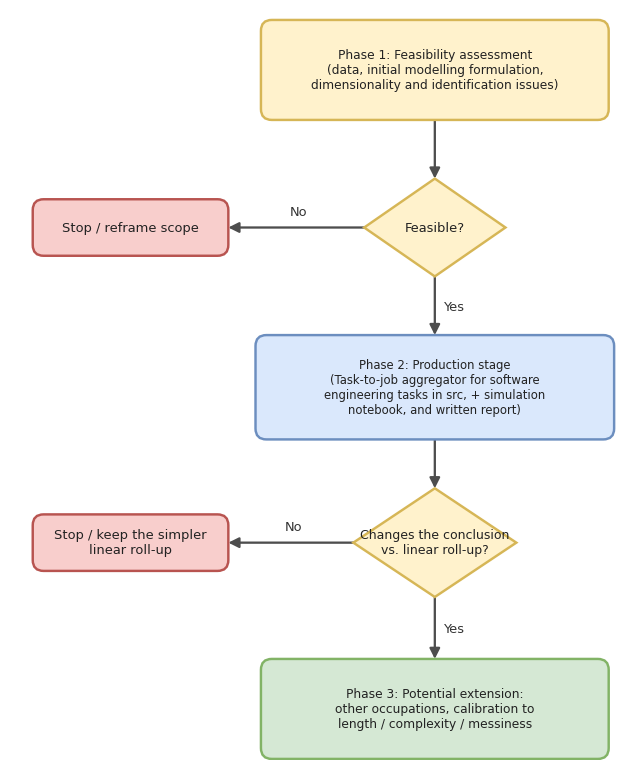

# Forecasting the economic impact of AI - structural tasks ->role aggregation

<!--
> **Living document.** Populated as the scoping conversation progresses. Sections are tagged **[settled]**, **[draft]**, or **[TBD]** so it is clear what is decided vs. still open. Structure follows the Faculty fellowship project-brief template (the sibling "harnesses & capabilities" brief). This document is for **Esther's workstream A**, *not* the harness project.
>
> - **Owner:** Esther Chevrot
> - **Started:** 2026-06-26
> - **Status:** scoping (goals: contribution stress-test -> feasibility -> initial plan)
> - **Related:** decision `[0003](../.cursor/notes/decisions/0003-kickoff-structural-task-role-aggregator.md)`; concept note `[task-to-role-aggregation](../notes/concepts/task-to-role-aggregation.md)`; 2026-06-19 brainstorm session note.
-->

## BACKGROUND

In July 2025, Faculty's CEO (now Accenture CTO), Marc Warner, convened a team to investigate the economic impact of AI's rapidly increasing capabilities. That programme is organised as a three-stage pipeline: **constraints/technologies -> tasks -> jobs/roles -> economy**.

This workstream targets the **Stage 1 -> Stage 2 seam**: how task-level automation forecasts are turned into statements about *jobs/roles*. Previous work (task->role mapping via O*NET & Blue Rose) has been relying on a **linear, time-weighted roll-up** `occupation_index = sum_k w_k * p_k`. This is an accounting identity that ignores non-separability/O-ring effects, endogenous task weights, reinstatement/new tasks, remaining-task expertise, and the gap between technical feasibility and economic profitability.

## Contribution

Overarching objective: **replace the naive linear roll-up with an economically-grounded job-production model** that turns task-level automation *forecasts* into occupation-level automation forecasts, with uncertainty. This contributes to the overall **"constraints -> tasks -> jobs -> labour market"** framework, while improving on current aggregation methodology.

The contribution is **not** assessed against the academic economics novelty bar, but against the **AI-automation-forecasting field** - OpenAI papers, Anthropic Economic Index, AISI/IFOW - which still uses the linear time-weighted roll-up. We believe contributions can be twofold:

- Bringing the best current economic structure into a forecasting field that still uses the accounting identity.
- Showing that it changes the answers on labour market impacts: different occupation rankings, different displacement timing, different sector winners/losers, etc.

## Applied research from main labs

- **OpenAI, "The AI Jobs Transition Framework" (2026)** ([note](../notes/papers/openai-2026-ai-jobs-transition-framework.md)) - maps near-term AI pressure across 921 occupations by bolting human-necessity + demand-elasticity filters onto the linear task-exposure roll-up; does not fix within-occupation aggregation.
- **Anthropic Economic Index (2026)** ([pdf](../papers/AI_impact_paper_Anthropic.pdf)) - measures real Claude usage mapped to O*NET tasks/occupations (automation vs. augmentation), still aggregating task coverage to occupations by time-share.
- **Eloundou et al., "GPTs are GPTs" (2023)** ([pdf](../papers/Eloudou_al_2023.pdf)) - the foundational task-level LLM exposure measure (share of occupation task time exposed to LLMs) that the lab frameworks build on.

## Economic literature

- **Gans & Goldfarb, "O-Ring Automation" (2026)** ([note](../notes/papers/gans-goldfarb-2026-o-ring-automation.md)) - theoretical microfoundation: proves linear exposure indices overstate displacement under complementarity, adoption is threshold/bundled, and labour income can rise under partial automation.
- **Hampole, Papanikolaou, Schmidt & Seegmiller (2025, NBER WP 33509)** ([note](../notes/papers/hampole-2025-ai-labor-market.md)) - closest structural work: CES over tasks with task-specific capital substituting for labour + endogenous time reallocation; two sufficient statistics (mean exposure, concentration), causally estimated via a hiring-network IV.
- **Autor & Thompson, "Expertise" (2025)** ([note](../notes/papers/autor-thompson-2025-expertise.md)) - the expertise of the *remaining* tasks drives the wage/employment direction after automation (a wage/skill layer, not an aggregator).
- **Acemoglu, "The Simple Macroeconomics of AI" (2025)** ([note](../notes/papers/acemoglu-2025-simple-macroeconomics-ai.md)) - only the *profitable* share of exposed tasks automates -> modest macro bound (~0.66% TFP / ~1% GDP over 10 yrs).
- **Svanberg et al., "Beyond AI Exposure" (2024)** ([note](../notes/papers/svanberg-2024-beyond-ai-exposure.md)) - empirical feasibility-vs-profitability gate: only ~23% of vision-task wages are currently cost-effective to automate.

## Scope and deliverables

The project runs as a phased tree gated at two points: a **feasibility gate** before the production stage, and a **decision-relevance gate** after it (does the structural aggregator change the conclusion vs. the linear roll-up?). Only if both pass do we reach the **potential extension** beyond software engineering tasks.

### Phase 1 - Feasibility assessment (first deliverable)

Can the structural aggregator be specified, calibrated, and validated with the data available? Assess:

- **Data:** task-level `p` (Luo et al. 2026, software), O*NET task statements + DWA/GWA hierarchy + importance/frequency weights, Hampole et al. (2025) estimates for calibration, and AI-rollout shocks for validation (TBC).
- **Initial modeling formulation:** the production technology (Nested CES within tasks + Leontief bottleneck across them; endogenous time allocation; profitability gate) 
- **Dimensionality and Identification:** how many free parameters/elasticities it requires; can human-AI and task-task substitution be identified from available data, or only borrowed from Hampole's IV estimates as calibration? -> a **calibrate-vs-estimate** call.
- **Uncertainty:** can noisy Stage-1 `p` (small-sample/judge variance) be propagated through the aggregator tractably (analytic vs. Monte Carlo)?

### Gate 1 - feasible?

- **No** -> stop or reframe the scope.
- **Yes** -> unlock the production stage below.

### Phase 2 - Production stage: Tasks-to-job aggregator

A structural **job-production aggregator** (CES/nested + Leontief bottleneck) that replaces the linear roll-up, calibrated for one software occupation using Luo et al. (2026) estimates.

- **Input:** task-level automation probabilities/forecasts from workstream 1 (task automation forecasts; Luo et al. 2026) and O*NET time weights.
- **Output:** occupation-level automation timing/curve with propagated uncertainty, compared against the naive linear-sum baseline. 
- **Deliverable:** reference implementation in `src/` + a runnable `simulations/` notebook + a report (motivation, methodology, results, comparison to linear roll-up).

### Gate 2 - does it change the conclusion?

- **No** (the structural aggregator reproduces the linear roll-up's occupation rankings/timing) -> keep the simpler linear roll-up.
- **Yes** (materially different rankings and/or displacement timing) -> extend to other occupations.

### Phase 3 - Potential extension

- Other **occupations and industries** (GDPval / EnterpriseVal as task coverage broadens and data access lands).
- **Calibration to task length `l`, complexity and messiness `m`** across the broader task set.

## Timeline and resourcing 

A single view of phases, effort, and estimated deliverable dates under two resourcing scenarios.

- **Scenario 1:** Esther 1 day/week in Phase 1; a 50% data scientist (2.5 d/wk) added in Phase 2 -> Phase 2 capacity ~3.5 d/wk.
- **Scenario 2:** Esther 2 days/week in Phase 1; a 50% data scientist (2.5 d/wk) added in Phase 2 -> Phase 2 capacity ~4.5 d/wk.
- Dates are approximate ("week of"), assume steady weekly cadence and no further holiday gaps; the two gates are decision points. 

| Phase / task | Est. work-days | Scenario 1 (Esther 1 d/wk) | Scenario 2 (Esther 2 d/wk) |
| --- | --- | --- | --- |
| **Phase 1 - Feasibility assessment** | **~12 d** | **week of Oct 26** | **week of Sep 14** |
| &nbsp;&nbsp;- Foundation + literature review | ~2 d | week of Aug 17 | week of Aug 10 |
| &nbsp;&nbsp;- Feasibility: data | ~2 d | week of Aug 31 | week of Aug 17 |
| &nbsp;&nbsp;- Feasibility: initial formulation | ~3 d | week of Sep 21 | week of Aug 31 |
| &nbsp;&nbsp;- Feasibility: dimensionality and identification | ~3 d | week of Oct 12 | week of Sep 7 |
| &nbsp;&nbsp;- Feasibility: uncertainty propagation | ~2 d | week of Oct 26 | week of Sep 14 |
| &nbsp;&nbsp;- Gate 1: feasible? (go/no-go + scoping note) | - | ~Oct 30 | ~Sep 18 |
| _+ data scientist @ 2.5 d/wk added from Phase 2_ | _&nbsp;_ | _capacity 3.5 d/wk_ | _capacity 4.5 d/wk_ |
| **Phase 2 - Production stage: tasks-to-job aggregator** | **~34 d** | **week of Jan 4, 2027** | **week of Nov 9** |
| &nbsp;&nbsp;- Specification (CES + Leontief bottleneck; profitability gate) | ~10 d | week of Nov 16 | week of Oct 5 |
| &nbsp;&nbsp;- Simulations using Luo (2026) estimates on software | ~6 d | week of Nov 30 | week of Oct 12 |
| &nbsp;&nbsp;- Calibration / estimation + uncertainty propagation | ~6 d | week of Dec 14 | week of Oct 19 |
| &nbsp;&nbsp;- Validation vs. linear roll-up | ~6 d | week of Dec 21 | week of Nov 2 |
| &nbsp;&nbsp;- Gate 2: changes the conclusion? | - | ~late Dec | ~Nov 6 |
| &nbsp;&nbsp;- Brief / report writing | ~6 d | week of Jan 4, 2027 | week of Nov 9 |
| **Phase 3 - Potential extension** | TBD | - | - |
| &nbsp;&nbsp;- Extend to other occupations & industries (GDPval / EnterpriseVal) | TBD | - | - |
| &nbsp;&nbsp;- Calibration to task length `l`, complexity/messiness `m` | TBD | - | - |

<!--
## APPROACH  [draft - revised 2026-07-01, Goal 3]

1. **Foundation + literature review** - contribution stress-test done (Hampole/Acemoglu/Autor-Thompson/Gans-Goldfarb; Goal 1); lock the repositioned framing and consolidate positioning in the concept note.
2. **Feasibility assessment [GATE]** - before committing to the specification, enumerate the concrete feasibility risks and decide *what we calibrate vs. estimate*. Seed list (to be worked in Goal 2):
   - **How many elasticities?** Count the free parameters the aggregator needs (human-AI substitution within tasks; task-task substitution/complementarity across tasks; bottleneck degree `nu -> 0`; endogenous time-allocation parameters). Anything at ~900-occ x ~20k-task scale is not separately estimable -> must be shared/calibrated.
   - **Identification** - can human-AI and task-task substitution be identified from available data (Luo `p`, AI-rollout shocks), or only borrowed from Hampole's IV estimates as calibration?
   - **O*NET <-> Luo `(l, m)` crosswalk dependency (thread B)** - the software `p` are indexed by Luo's `(l, m)` coordinates, not O*NET tasks; how much crosswalk is needed even for the software MVP?
   - **Noisy Stage-1 `p` propagation** - `p` carry small-sample/judge variance; can uncertainty be propagated through the aggregator tractably (analytic vs. Monte Carlo)?
   - **Scale / computation** - what is tractable for one occupation now vs. all occupations later?
   - **Output:** a go/no-go call + a short "calibrate-vs-estimate" scoping note.
3. **Specification** - define the job-production technology (CES within tasks, Leontief bottleneck across them; endogenous time allocation; profitability gate).
4. **Simulations using Luo (2026) estimates on software engineering** - feed Luo's task-level `p` through both the structural aggregator and the weighted linear sum on one software occupation; compare outputs.
5. **Calibration / estimation** - calibrate structure; estimate a few key parameters (borrowing Hampole magnitudes where not separately identified); propagate Stage-1 forecast uncertainty.
6. **Validation against the weighted linear sum** - occupation rankings + displacement **timing**, with Hampole-style realised effects as a benchmark.
7. **Brief / paper writing** - motivation, methodology, results, recommendations.
8. **Extension to GDPval / EnterpriseVal** (if feasible) - extend across occupations as task coverage broadens and data access lands.

## Risks and Dependencies  [draft]

- **Novelty risk (primary):** overlap with Hampole et al. (2025) - **now confirmed manageable** by the deep reads (2026-07-01): Hampole is local/backward-looking, Gans-Goldfarb owns the O-ring *theory* but has no empirical/forecast/occupation implementation, and OpenAI's applied framework still uses the linear sum and explicitly flags the bottleneck/threshold gap. A's forecasting + threshold + profitability + applied-bridge repositioning holds.
- **Field-velocity / being-scooped risk (new):** the applied field is shipping fast (OpenAI US Apr 2026 + EU Jun 2026). Mitigate by moving promptly on the MVP and positioning as the structural layer that plugs into (not competes with) these descriptive frameworks.
- **Data access:** the most useful Faculty inputs (scored GDPval results, Bayesian forecast trajectories, exact Stage-2 spec, "Blue Rose") are **not** in the current export; need member-level Notion/MCP access. Guest access blocks both MCP and most exports.
- **Dependency on thread B** (O*NET <-> `l`,`m` crosswalk) for empirical work beyond software.
- **Identification/feasibility:** deep elasticities likely not estimable at scale -> calibrate + estimate a few parameters.
- **Inherited measurement error:** Stage-1 `p` are noisy (small samples, judge variance); must propagate.

## Key stakeholders  [draft 2026-07-01, Goal 3]

- **Lead / sole delivery (current):** Esther Chevrot - 1-2 days/week in Phase 1 (see Timeline and resourcing for the two scenarios).
- **Faculty R&D (Stage 1 interface):** Xiaoliang (Luo), Ken Luo - source of the Stage-1 task-level `p` (Luo et al. 2026) and the natural validation-benchmark counterparts. Needed to unblock member-level data access (GDPval scores, Bayesian trajectories, Stage-2 spec, "Blue Rose").
- **Second contributor (prospective):** an economist / data scientist @ ~50% - added in Phase 2 (production stage; see Timeline and resourcing); DS profile for the implementation/simulation work and later occupation scale-out, economist profile if identification proves hard.
- **Commercial / Accenture (Stage 2-3 consumer):** *contact TBD* - downstream consumer of A's output (workforce planning; Stage-3 macro model).
- **Academic positioning / co-authors:** *TBD.*

### Changelog

- **2026-06-26** - Created. Populated BACKGROUND, OBJECTIVES + Goal-1 stress-test finding (Hampole pre-emption + repositioning), initial SCOPE/APPROACH/DATA/RISKS. MVP, delivery, stakeholders, timeline left TBD pending Goals 2-3.
- **2026-06-26 (later)** - **Locked the applied framing** in OBJECTIVES: contribution benchmarked against the AI-automation-forecasting field (TBI / Anthropic / AISI), not the academic econ bar; Hampole (2025) recast as calibration asset + validation benchmark; added the field success bar (decision-relevance + adoptability). Concept note updated with the same framing.
- **2026-07-01** - **Finished Goal-1 de-risking reads.** Added paper notes for Gans-Goldfarb 2026 (O-ring), Autor-Thompson 2025 (expertise), Acemoglu-Restrepo 2019, Acemoglu 2025 (PDF missing - flagged), Svanberg 2024. Marked stress-test reads done; novelty risk confirmed manageable. Added **competitive-landscape assessment of OpenAI's AI Jobs Transition Framework** (adjacent/validating, not a competitor) + a new field-velocity risk. Flagged that the local OpenAI PDF is image-based/possibly mislabelled ("Beyond AI Exposure").
- **2026-07-01 (later)** - Acemoglu 2025 PDF added to `papers/`; paper note **verified against source** and the three "PDF missing / verify" caveats cleared (note, concept note, this doc).
- **2026-07-01 (Goal 3)** - **Filled the TBD sections.** Revised APPROACH into 8 steps (added a **Feasibility-assessment gate** as Step 2, with a seeded issue list; renamed "bootstrap data" -> "Simulations using Luo (2026) estimates on software engineering"). Settled the **MVP** (de-risked single software occupation on Luo `p`, aggregator vs. linear sum, robust to the data-access blocker). Added a **Resourcing and allocation** section with gate-tied ramps (Esther 1 -> 2.5 d/wk; +50% second person at scale-out) and a **Timeline** with per-step effort-days + two calendar scenarios (1 d/wk ~= 29 wk vs. gated ramp ~= 17 wk to paper draft). Filled **Delivery** and **Stakeholders**. Decision recorded in `[0004](../.cursor/notes/decisions/0004-gated-resourcing-model.md)`.
- **2026-07-02** - **Restructured the scope into a phased decision tree** (`Scope and deliverables`): a mermaid flowchart plus nested bullets for Phase 1 (feasibility assessment - first deliverable), a yes/no gate, Phase 2 (production stage: tasks-to-job aggregator, with explicit input/output/deliverable), and Phase 3 (potential extension). Added a second gate after Phase 2 (does the aggregator change the conclusion vs. the linear roll-up?). **Reconciled** the overlapping sections into a single source of truth: folded `DATA SCOPE and DELIVERY` Input/Output into Phase 2 and removed the standalone `Deliverables` section.
- **2026-07-02 (later)** - **Consolidated resourcing + timeline into a single `Timeline and resourcing` table** (phase/task x work-days x Scenario 1 x Scenario 2), starting the week of 10 Aug 2026. Scenario 1 = Esther 1 d/wk in Phase 1 + a 50% DS in Phase 2; Scenario 2 = Esther 2 d/wk in Phase 1 + a 50% DS in Phase 2 (Phase 3 left open). Superseded the prior effort/calendar/swimlane tables and the standalone `Resourcing and allocation` section; these scenarios refine the allocation numbers in decision `0004` (gating logic unchanged).
- **2026-07-03** - **Swapped the scope mermaid flowchart for the rendered PNG** (`diagrams/workstream-a-scope-decision-tree.png`, editable source in the sibling `.drawio`): "No" branches now peel left into the stop boxes. Relabelled the three nodes as **Phase 1** (feasibility: data, initial modelling formulation, dimensionality and identification issues), **Phase 2** (production stage: task-to-job aggregator for software-engineering tasks in `src/`, + simulation notebook and written report), and **Phase 3** (potential extension: other occupations, calibration to length/complexity/messiness).

-->